* Table of Contents
{:toc}

--------------------------------------------------------------------------------------------------------------------

## **Setting up, getting started**

Refer to the guide [_Setting up and getting started_](SettingUp.md).

--------------------------------------------------------------------------------------------------------------------

## **Design**

### Architecture

   *Figure 1: Architecture Diagram of the application*

The ***Architecture Diagram*** given above explains the high-level design of the App. Given below is a quick overview of each component.

:bulb: **Tip:** The `.puml` files used to create diagrams in this document can be found in the [diagrams](https://github.com/se-edu/addressbook-level3/tree/master/docs/diagrams/) folder. Refer to the [_PlantUML Tutorial_ at se-edu/guides](https://se-education.org/guides/tutorials/plantUml.html) to learn how to create and edit diagrams.

**`Main`** has two classes called [`Main`](https://github.com/AY2021S1-CS2103T-W10-3/tp/blob/master/src/main/java
/seedu/address/Main.java) and [`MainApp`](https://github.com/AY2021S1-CS2103T-W10-3/tp/blob/master/src/main/java/seedu/address/MainApp.java). It is responsible for:

* At app launch: Initializes the components in the correct sequence, and connects them up with each other.
* At shut down: Shuts down the components and invokes cleanup methods where necessary.

[**`Commons`**](#common-classes) represents a collection of classes used by multiple other components.

The rest of the App consists of four components.

* [**`UI`**](#ui-component): The User Interface of the App.
* [**`Logic`**](#logic-component): The command executor.
* [**`Model`**](#model-component): Holds the data of the App in memory.
* [**`Storage`**](#storage-component): Reads data from, and writes data to, the hard disk.

Each of the four components,

* defines its *API* in an `interface` with the same projectName as the Component.
* exposes its functionality using a concrete `{Component Name} Manager` class (which implements the corresponding API `interface` mentioned in the previous point.

For example, the `Logic` component (see the class diagram given below) defines its API in the `Logic.java` interface
 and exposes its functionality using the `LogicManager.java` class which implements the `Logic` interface.

**How the architecture components interact with each other**

The *Sequence Diagram* below shows how the components interact with each other for the scenario where the user issues
 the command `delete 1`, which deletes project 1.

The sections below give more details of each component:

   *Figure 2: Sequence Diagram of an example of a user input*

### UI component

   *Figure 3: Class Diagram of the UI component*

**API** :
[`Ui.java`](https://github.com/AY2021S1-CS2103T-W10-3/tp/blob/master/src/main/java/seedu/address/ui/Ui.java)

The UI consists of a `MainWindow` that is made up of parts e.g.`CommandBox`, `ResultDisplay`, `ProjectListPanel`, 
`StatusBarFooter`, `ProjectDashboard`, `EmptyDashboard`, `TaskDashboard`, `TeammateDashboard`
 etc. All these, including the `MainWindow`, inherit from the abstract `UiPart` class.

The `UI` component uses JavaFx UI framework. The layout of these UI parts are defined in matching `.fxml` files that are 
in the `src/main/resources/view` folder. For example, the layout of the [`MainWindow`](https://github.com/AY2021S1-CS2103T-W10-3/tp/blob/master/src/main/java/seedu/address/ui/MainWindow.java) is specified in [`MainWindow.fxml`](https://github.com/AY2021S1-CS2103T-W10-3/tp/blob/master/src/main/resources/view/MainWindow.fxml)

The `UI` component,

* Executes user commands using the `Logic` component.
* Listens for changes to `Model` data so that the UI can be updated with the modified data.

### Logic component

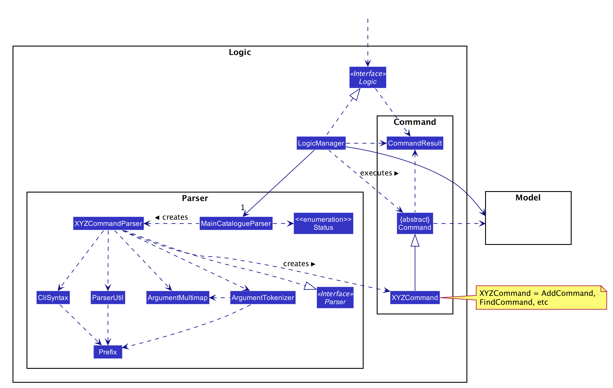

   *Figure 4: Class Diagram of the logic component*

**API** :
[`Logic.java`](https://github.com/AY2021S1-CS2103T-W10-3/tp/blob/master/src/main/java/seedu/address/logic/Logic.java)

1. `Logic` component uses the `MainCatalogueParser` class to parse the user command.
1. This results in a `Command` object which is executed by the `LogicManager` (only commands with correct scope will be generated: refer to "Scoping feature").
1. The command execution can affect the `Model` (e.g. adding a project).
1. The result of the command execution is encapsulated as a `CommandResult` object which is passed back to the `Ui`.
1. In addition, the `CommandResult` object can also instruct the `Ui` to perform certain actions, such as displaying help to the user.

Given below is the Sequence Diagram for interactions within the `Logic` component for the `execute("delete 1")` API call.

   *Figure 5: Sequence Diagram for "delete" input*

:information_source: **Note:** The lifeline for `DeleteCommandParser` should end at the destroy marker (X) but due to a limitation of PlantUML, the lifeline reaches the end of diagram.

### Model component

   *Figure 6: Class Diagram of the Model component*

**API** : [`Model.java`](https://github.com/AY2021S1-CS2103T-W10-3/tp/blob/master/src/main/java/seedu/address/model/Model.java)

The `Model`,

* stores a `UserPref` object that represents the user’s preferences.
* stores the main catalogue data, which is essentially a list of `Project`s, a list of `Person`s, and a list of their associations `Participation`s.
* exposes unmodifiable `ObservableList<Project>` and `ObservableList<Person>` that can be 'observed' e.g. the UI can be bound to this list so that the UI automatically updates when the data in the list change.
* keeps a status about the current status of the application which may affect the execution of commands.
* does not depend on any of the other three components.

### Storage component

   *Figure 7: Class Diagram of the Storage component*

**API** : [`Storage.java`](https://github.com/se-edu/addressbook-level3/tree/master/src/main/java/seedu/address/storage/Storage.java)

<!--Use composition instead of aggregation?-->

The `Storage` component,

* can save `Project`, `Person`, `Task`, `Participation` objects and their details in json format and read it back.
* can save the main catalogue data in json format and read it back.

### Common classes

Classes used by multiple components are in the `seedu.addressbook.commons` package.

--------------------------------------------------------------------------------------------------------------------

## **Implementation**

This section describes some noteworthy details on how certain features are implemented.

### Logging of data

To record data, after each action, we used the`java.util.logging` package.  

Logging implements several levels using  to describe at a glance the severity of the message. This allows developers 
to identify the message at a glance.

The log level is set to `INFO` by default, but can be modified to any other level with the use of the setter
method `setLogLevel`.

**Logging levels**
- SEVERE (events that are of considerable importance and which will prevent normal program execution.   
They should be reasonably intelligible to end users and to system administrators.)
- WARNING (may cause issues, proceed with caution)
- INFO (should be used for reasonably significant messages that will make sense to 
end users and system administrators.)

There are many other logging levels available in the Level class, however these above should be sufficient.

### Scoping feature

#### Implementation

The scoping mechanism is facilitated by an `enum` class `Status` in `MainCatalogue`. Possible values of `Status` are `PROJECT_LIST`, `PERSON_LIST`, `PROJECT`, `PERSON`, `TASK`, and `TEAMMATE`.
The possible values of `Status` corresponds to a UI status as follows:

Scope | Left panel | Middle panel | Right panel
--------|------------------|-------|----------
`PROJECT_LIST` | project list | empty | empty
`PERSON_LIST` | person list | empty | empty
`PROJECT` | project list | project dashboard | empty
`PERSON` | person list | person dashboard | empty
`TASK` | project list | project dashboard | task dashboard
`TEAMMATE` | project list | project dashboard | teammate dashboard

As per in the description above, can understand the scopes using the hierarchy as follows:
* global
    * `PROJECT_LIST` 
      * `PROJECT`
        * `TASK` 
        * `TEAMMATE`
    * `PERSON_LIST`
      * `PERSON`
      
In most cases a command that is valid in a parent scope would be valid in any descendant scopes, but there may be some exceptions.

The `Status` of `MainCatalogue` is open to be accessed in other `Model` components by a public getter. The `MainCatalogue` has a field `project` which is an `Optional` object of `Project`. 
This is a pointer to the project that is expected to be the focus for the application if it is in the `PROJECT` or lower status. Similarly, there is a pointer in each `Project` to keep the task of focus if the application is in `TASK` status.
The switch of `Status` is implemented by the following operations:

* `MainCatalogue#enter(Project project)` — Switches to `PROJECT` status and updates the project on view to the given project.
* `MainCatalogue#enter(Person person)` — Switches to `PRERSON` status and updates the project on view to the given project.
* `MainCatalogue#enterTask(Task task)` — Switches to `TASK` status and updates the task on view to the given task.
* `MainCatalogue#enterTeammate(Participation teammate)` — Switches to `TEAMMATE` status and updates the teammate on view to the given teammate (participation).
* `MainCatalogue#quit()` — Switches to the parent status, and clear the lower-level pointer.

These operations are exposed in `Model` interface with the same name.

In the GUI design of the application, the three columns correspond to three levels of the status. 
The left column refers to the top level, which is `PROJECT_LIST` or `PERSON_LIST`, and it thus consists of a list of projects or persons.
The middle column refers to the middle level, which can be `PROJECT` or `PERSON`, and it shows the details of the project or person of focus as stored in `MainCatalogue`. 
The right column refers to the bottom level, which can be `TASK` or `TEAMMATE`, and it shows the details of the object this status refers to that is of focus as stored in its parent object (project or person).

Users are allowed to switch the scoping status while using the app using user input commands. Relevant commands include:

* `ListProjectsCommand` — Requests to view the list of `Project`s.
* `ListPersonsCommand` — Requests to view the list of `Person`s.
* `StartProjectCommand` — Enters a project with its index in the current filtered list of projects and switches to `PROJECT` status. This corresponds to `enter` method with input type `Project`.
* `StartPersonCommand` — Enters a person with its index in the current filtered list of persons and switches to `PERSON` status. This corresponds to `enter` method with input type `Person`.
* `ViewTaskCommand` — Requests to view the detailed information of a task. This corresponds to `enterTask` method.
* `ViewTeammateCommand` — Requests to view the detailed information of a teammate (which is represented by participation). This corresponds to `enterTeammate` method.
* `LeaveCommand` — Leaves the current object of focus, i.e. Switches to the parent status and clear the lower-level pointer. This corresponds to `quit` method.

All commands have a restriction on the scope. This is seen in `CommandParser`. If a command is invoked but the application is not in the correct scoping status, an `InvalidScopeException`
would be thrown and an error message would be shown on the GUI.

Step 1. The user launches the application. The default status of scope is `PROJECT_LIST`, and `project` in `MainCatalogue` is initialized to an empty `Optional` object.
(The `person` in `MainCatalogue` is also initialized to be empty, and all behaviors under `PERSON_LIST` scope would be very similar to `PROJECT_LIST`, so relevant behaviors will not be repeated in this document.)

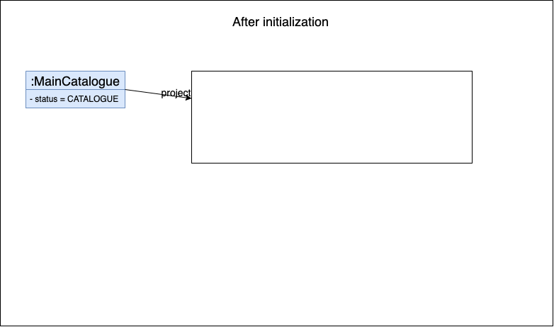

   *Figure 8: Diagram of the initial scoping*

:information_source: **Note:** At this stage, commands at non-`PROJECT_LIST` level cannot be executed.

The following sequence diagram shows how scoping works in the application.

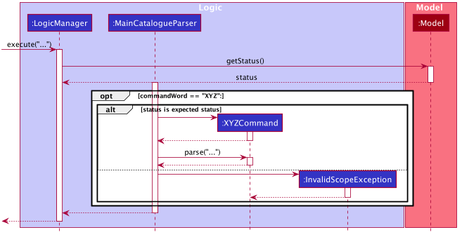

   *Figure 9: Sequence Diagram of the scoping components with an input*

Step 2. The user executes `startproject 3` command to view the details of the project of index 3 in the main catalogue. The `startproject` command
calls `enter`, causing a switch of scoping status and assignment of `project` of focus in `MainCatalogue`.

   *Figure 10: Diagram of the scoping after 'startproject 3' command*

:information_source: **Note:** The `startproject` command calls `enter` method in model, causing a switching of level and updates the project of focus.

The following sequence diagram shows the execution of startproject command.

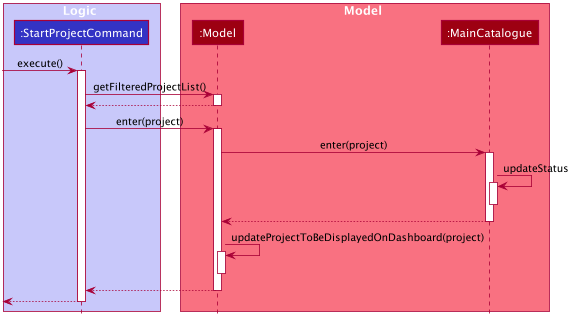

   *Figure 11: Sequence Diagram of the 'startproject' command*

Step 3. The user executes `viewtask 5` command to view the details of the task of index 5 in the filtered task list of current project.
The `viewtask` command calls `enterTask`, causing a switch of scoping status and assignment of `taskOnView` in the current project.
(`viewteammate` command is executed similarly.)

   *Figure 12: Diagram of the scoping after 'viewtask 5' command*

:information_source: **Note:** The `viewtask` command calls `enterTask` method in model, causing a switching of level and updates the task of focus.

The following sequence diagram shows the execution of view task command.

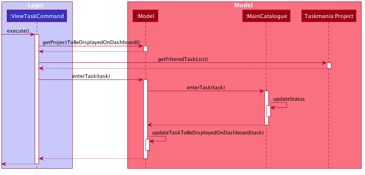

   *Figure 13: Sequence Diagram of the 'viewtask' command*

Step 4. The user executes `startproject 2` command to view details of project of index 2 in the current list of projects instead.
The scope is switched to `PROJECT`, project of focus is updated to a new project and the task on view is updated to empty.

   *Figure 14: Diagram of the scoping after 'startproject 2' command*

Step 5. The user executes `leave` command to go to the parent status.
Currently the application is at `PROJECT` status, so after execution of `leave` command, the new status would be `PROJECT_LIST`.
The `leave` command calls `quit` method.

   *Figure 15: Diagram of the scoping after 'leave' command*

:information_source: **Note:** The `leave` command calls `quit` method in model, causing a switching of level and updates the project and task of focus.

The following sequence diagram shows the execution of leave command. Note that the leave command will do nothing if the application is already in the `PROJECT_LIST` scope.

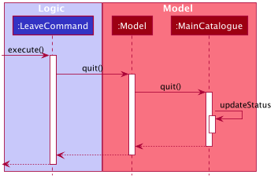

   *Figure 16: Sequence Diagram of the 'leave' command*

The following activity diagram summarizes the scoping features when a user executes a new command:

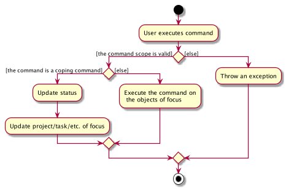

   *Figure 17: Activity Diagram of the scoping components*

#### Design consideration:

##### Aspect: How to check scope

* **Alternative 1 (current choice):** Parses a command only if the scoping is valid.
  * Pros: Easy to implement.
  * Cons: May increase coupling because parser needs to know the status.

* **Alternative 2:** Checks the validity of scope of a command upon execution.
  * Pros: Will not increase coupling with parser.
  * Cons: The scoping features of each command are not explicitly seen, and may increase coupling with command.
  
##### Aspect: How to establish hierarchy of scopes

* **Alternative 1 (current choice):** Use a hierarchy scheme to define scopes, and all scoping status at the same level are strictly restricted to its parent scope.
  * Pros: Only need one status field in `Model`, and easy to extend.
  * Cons: When lower levels of `PERSON` is implemented, child scopes of `PROJECT` like `TASK` might be reused, but it is not easy to implement this.

* **Alternative 2:** Keeps a status for every level.
  * Pros: Do not need a hierarchy understanding of all scopes anymore, and will solve the duplication problem in alternative 1.
  * Cons: Need several status field in `Model`, which may make the code more complicated and harder to extend. 
  
### New Task feature

#### Implementation

The implementation of the task feature involves adding new tasks created in the `Project` class and storing them with a `JsonAdaptedTask` class which is contained by the `JsonAdaptedProject` class.

The new task command has to be prefixed with 'addtask' and include **some** of the following fields:
 - `tn/` prefix followed by the name of the Task
 - `tp/` prefix followed by the percentage of the task that has been finished
 - `d/` prefix followed by a description of the task (Optional)
 - `td/` prefix followed by the deadline of the task (Optional)

 *The system validates each field upon entry by the user, and failing the validation, will display to the user that the command failed, and requesting the user to try again.*

Given below is an example usage scenario and how the add task and edit task mechanism behaves at each step.

After entering the project scope of a chosen project, the user enters the command to add a new task such as "addtask tn/Create Person class tp/25 td/9-11-2020 00:00:00".
The command text is passed into `LogicManager` (an implementation of Logic) which passes the raw text into the `MainCatalogueParser` to validate the first command word, which in this case is `addtask`. A new instance of `AddTaskCommandParser` class is then created which proceeds to parse the various fields of the command. Any invalid fields such as invalid field prefixes or invalid format of data would throw an exception at this stage. 

If the fields are all valid, a new `Task` object would be created and passed into the `AddTaskCommand` class. 

Within the `AddTaskCommand` class, an instance of `AddTaskCommand` is created, along with an instance of the task created in the same class and this instance of `Command` is passed back to `LogicManager`.

LogicManager then calls the method `execute` of the `AddTaskCommand` which stores the task into the respective project's task list.

The diagram below summarises the events above with the help of a sequence diagram:
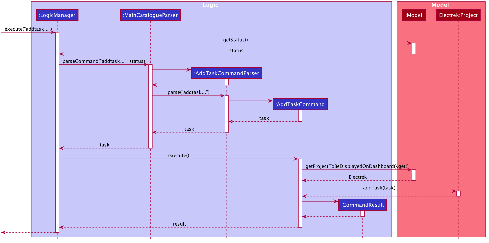

   *Figure 18: Sequence Diagram of the 'addtask' command*
   
The diagram below gives a short overview on what happens when a user's input is received:

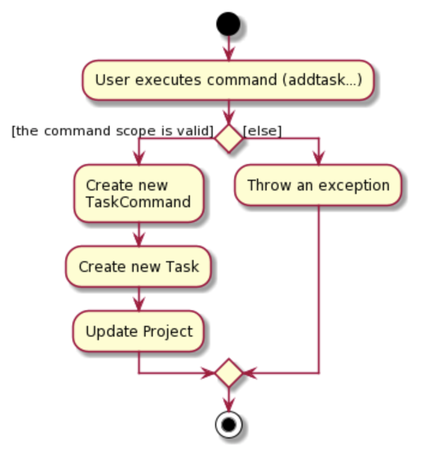

   *Figure 19: Activity Diagram of the 'addtask' command*
   
#### Design consideration:

##### Aspect: Whether a Task object can be instantiated without filling up all of its attributes

* **Alternative 1:** All fields must be filled up
  * Pros: No ambiguity regarding the task, all information of the task is standardised.
  * Cons: The user may not know every aspect of a task such as the description.

* **Alternative 2 (current choice):** Only some fields have to be filled up (i.e. name and progress)
  * Pros: Task can be created without knowing all the information of a task.
  * Cons: Users might forget to input a deadline or description for the task which might cause trouble for the user when sorting or filtering his/her tasks as the system would not inform them they had no input a deadline or description for the task.
  
##### Aspect: Whether all tasks in a project have to be unique
* **Alternative 1:** Tasks in a project can be duplicated
  * Pros: The user can keep the name of the task short and simple. For instance, two task could have the same name `Update UG` with differing task descriptions of `update UG with glossary` and `update UG with FAQ`.
  * Cons: The user may be confused by the list of tasks with the same name and deadline or might have accidentally created two of the same task but only intended to create one.

* **Alternative 2 (current choice):** A task is not allowed to be created with the same name and deadline as an existing task
  * Pros: Tasks with the same name and deadline are very likely to be the same task and so will spare the user from accidentally keying in the same task twice.
  * Cons: Tasks with the same name and deadline but with different descriptions are still not allowed to be created.

### Filtering feature

#### Implementation

The task filtering mechanism is facilitated by the predicte `taskFilter` kept in the Project class. When `UI` component requested for the filtered and sorted task list, the task list filtered by the `taskFilter` will be returned. 

Tasks can be filtered by following attributes of a task (using command `filter PREFIX/ATTRIBUTE`):

- the Github user name `gitUserName` of one of the task's assignees (prefix: `ta/`)
- the task's name: `taskName` (prefix: `tn/`)
- the task's deadline: `deadline` (prefix: `td/`)
- the task's progress: `progress` (prefix: `tp/`)
- whether the task is done: `isDone` (prefix: `done/`)

Additionally, one can also use `filter start/START_DATE end/END_DATE` to find tasks whose deadlines are within the time range between the `START_DATE` and the `END_DATE`.

The predicate used to filter tasks is generated in the `TaskFilterCommandParser` and encapsulated by the `TaskFilterCommand` that the paser returns. When the `TaskFilterCommand` is executed, the `taskFilter` of the current project will be updated and  `UI` will be refreshed automatically.

When the user want to clear the filter using `alltasks` , the `taskFilter` of the current project will be changed to a predicate that always returns true. Then, the `UI` will correspondingly show all the tasks in the current project.

Given below is an example usage scenario and how the task filtering mechanism behaves at each step:

Step 1. The user uses `startproject` to open a project called "Taskmania". Suppose there are currently three tasks in this project: `task1`, `task2`, and `task3`. There are three persons involved: a person named "Tan Chia Qian" whose Github username is "TCQian", a person named "Tian Fang" whose Github username is "T-Fang" and a person named "Li Jiayu" whose Github username is "lll-jy".  `task1` is assigned to "Tan Chia Qian" and "Tian Fang", `task2` is assigned to "Tian Fang", and `task3` is assigned to "Li Jiayu".

   *Figure 20: Object Diagram of the project 'Taskmania'*

Step 2. The user executes `filter ta/T-Fang` command to find all tasks that assigned to a "Tian Fang" whose Github username is "T-Fang". the command is eventually passed to `TaskFilterCommandParser` and the parser will identify the type of the filtering condition using the prefix entered and create the corresponding task predicate. In this case, `ta/` indicates that a predicate that filter tasks by their assignees' Github usernames should be created. 

Step 3. The `LogicManager` executes the `TaskFilterCommand` returned by the parser. The `TaskFilterCommand` will get the current project ("Taskmania") from the `Model` and update the `taskFilter` predicate inside the "Taskmania" project. Therefore, the filtered task list of "Taskmania" will only contain `task1` and `task2`.

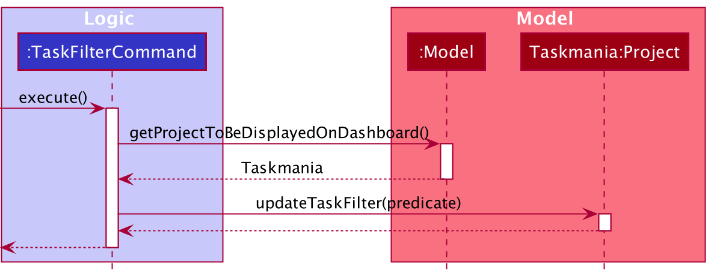

   *Figure 21: Sequence Diagram of the 'filter' command*

Step 4. After seeing tasks that have been assign to "Tian Fang", the user wants to take a look at other tasks in "Taskmania". The user executes `alltasks` to see all the tasks in "Taskmania". the `MainCatalogueParser` parses the command and creates a `AllTasksCommand`. 

Step 5.  The `LogicManager` executes the`AllTasksCommand` returned. The `AllTasksCommand` will get the current project ("Taskmania") from the `Model` and call the `showAllTasks()` method inside the "Taskmania" project. Then the `taskFilter` inside "Taskmania" will be replaced by a predicate that always returns true and all the tasks will be shown.

   *Figure 22: Sequence Diagram of the 'alltasks' command*

In the example above, the users can also filter the task list in different ways and the `taskFilter` predicate in "Taskmania" will be updated correspondingly:

- `filter tn/Filter`: `task2` and `task3` will be displayed
- `filter tp/50`: `task3` will be displayed
- `filter done/false`: `task1` and `task3` will be displayed
- `filter td/19-10-2020 13:30:00 `: `task1` will be displayed
- `filter start/16-10-2020 end/19-10-2020`: `task1` and `task2` will be displayed

The following activity diagram summarizes what happens when a user executes a task filter command:

   *Figure 23: Activity Diagram of the filter command*

#### Design consideration:

##### Aspect: Which attribute of assignees should be used to filter tasks

* **Alternative 1 (current choice):** Assignee's Github username
  * Pros: Avoid viewing tasks of another person with the same personName. (Github username is unique)
  * Cons: The user might not always remember the GitHub usernames of teammates.

* **Alternative 2:** Assignee's personName
  * Pros: More intuitive when there are no teammates with the same name.
  * Cons: If two teammates have the same name, the task filter by their name will display tasks that have been assigned to any of them.

##### Aspect: Whether to clear filter when user re-enters the project

* **Alternative 1 (current choice):** Keep the filter and display filtered tasks when the user re-enters the project
  * Pros: Task list remains unchanged (e.g. the user don't have to filter everytime (s)he re-enters the same project if (s)he only wants to see tasks assigned to him/her ) .
  * Cons: The user might not be able to see all the tasks when (s)he enters the project.
* **Alternative 2:** Clear the filter when the user re-enters the project
  * Pros: The user always gets to see all the tasks every time (s)he enters the project.
  * Cons: The user have to filter everytime (s)he re-enters the same project if (s)he only wants to see tasks assigned to him/her.

### New Teammate feature

#### Implementation

The implementation of New Teammate involves both the storing of the New Teammate in memory through the use of `Participation` as well as storing the Teammate in the JSON file on the hard disk using the `Storage` class. 

The New Teammate created is added in the following places:
 - global static variable `allPeople` in the Person class 
 - within the project it was created for, in the associated Participation class

The New Teammate command has to be prefixed with `addteammate` and include **all** of the following fields:
 - `mn/` prefix followed by the name of the new teammate
 - `mg/` prefix followed by the teammate's Github User Name
 - `mp/` prefix followed by the phone number of the teammate
 - `me/` prefix followed by the email of teammate
 - `ma/` prefix followed by the address of the teammate
 - *Each of the fields above is validated upon entry by the user, and failing the validation, will display to the user that the command failed, and requesting the user to try again.*

The teammate is created in the project scope and assigned to that project. Further assignment of that user to other projects can be done in the scope of other projects.

Given below is an example usage scenario and how the `AddTeammate` mechanism behaves at each step:

Step 1: The user enters `startproject 2` for example to start project 1 from the mainscreen.The user is greeted with the
 projects list on the left, and the description of the project in the centre.

   *Figure 24: What the app looks like after 'start 2' command*

Step 2: The user enters a AddPerson command such as `addteammate mn/John Ivy mg/Ivydesign98 mp/82938281 me/imjon
@gmail.com ma/13 Cupertino Loop`. The command text is passed into `LogicManager` (an implementation of Logic) which
 passes the raw text into the `MainCatalogueParser` to validate the first command word, which in this case is
  `addperson`. A new instance of `TeammateCommandParser` class is then created which proceeds to parse the various
   fields of the command. Any invalid fields such as invalid field prefixes or invalid format of data would throw an exception at this stage. 

If the fields are all valid, a new `Person` object would be created in the same class and passed into the
 `AddPersonCommand` class. 

Within the `AddTeammateCommand` class, an instance of `AddPersonCommand` is created, along with an instance of the
 teammate created in the same class and this instance of `Command` is passed back to `LogicManager`.

LogicManager then calls the method `execute` of the NewTeammateCommand which stores the teammate into the respective
 project's participation list, and for the project to be stored in the teammate's participation list. 
 While seeming to increase coupling, it however keeps both classes separate and would not break each other when something is changed.

The diagram below summarises what is happening above with the help of a sequence diagram:
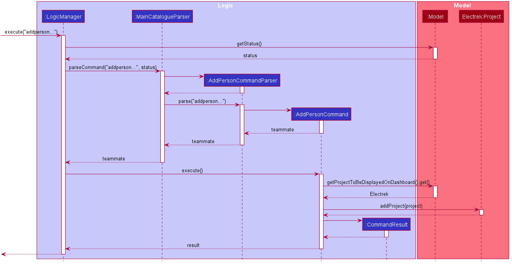

   *Figure 25: Sequence Diagram of the 'addteammate' command*

The diagram below gives a short overview on what happens when a user's input is received:

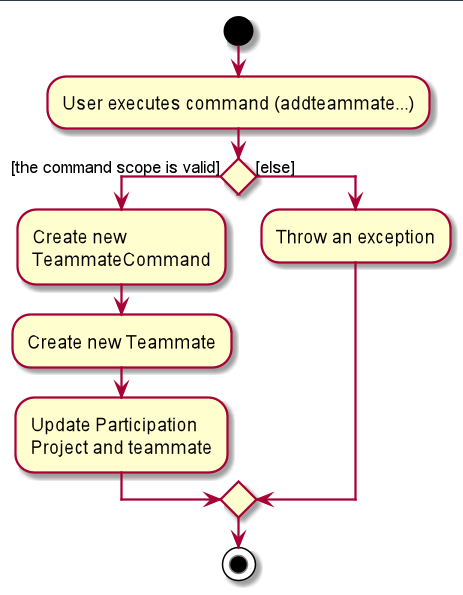

   *Figure 26: Activity Diagram of the 'addteammate' command*

#### Design consideration:

##### Aspect: Whether Teammate can be instantiated without filling up all attributes

* **Alternative 1 (current choice):** All fields must be filled up
  * Pros: No ambiguity about a teammate, every teammate's information is standardised.
  * Cons: The user may not know every aspect of a user such as his address, for example.

* **Alternative 2:** Only some fields have to be filled up, such as gitUserName and name.
  * Pros: Teammate can be created without knowing all information of a user.
  * Cons: Contacting such teammates would be difficult as the user would not be pressed to enter the teammate's
  phone number or address. 

##### Aspect: Whether to take name as an attribute when gitUserName is already present as an attribute

* **Alternative 1 (current choice):** Keep both name and gitUserName
  * Pros: GitUserName may be something entirely different from the teammate's name, and would be difficult
  for the user to identify if the user simply knew the teammate by his real name.
  * Cons: The gitUserName exactly matches the teammate's name, and the name field is irrelevant. However, this is 
  generally quite rare.
* **Alternative 2:** Only have gitUserName as an attribute.
  * Pros: The user has one less attribute to enter when instantiating the teammate.
  * Cons: If the gitUserName is very different from the teammate's actual name, it may be difficult for the user
  to remember, as is often the case for gitUserNames.

### Delete Person feature

#### Implementation

The implementation of DeleteTeammate involves both the deleting of the teammate in memory through the use of
 `Participation`, deleting from all projects the teammate is a part of, as well as deleting the Teammate in the JSON
  file on the harddisk using the `Storage` class.

The DeleteTeammate created is removed in the following places:
 - global static variable `allPeople` in the Person class 
 - within the project it added to, in the associated Participations.
 
The Delete Teammate command has to be prefixed with `deleteperson` and include the following field:
 - `mg/` prefix followed by the teammate's Github User Name

*The field above is validated upon entry by the user, and failing the validation, will display to the user that the
  command failed, and request the user to try again.*

Delete Teammate is also performed in the scope of `ListPersons`.

Given below is an example usage scenario and how the `DeletePerson` mechanism behaves at each step:

Step 1: The user enters `listpersons` for example to list all persons from the mainscreen.The user is greeted with the
 projects list on the left, and the description of the project in the centre.

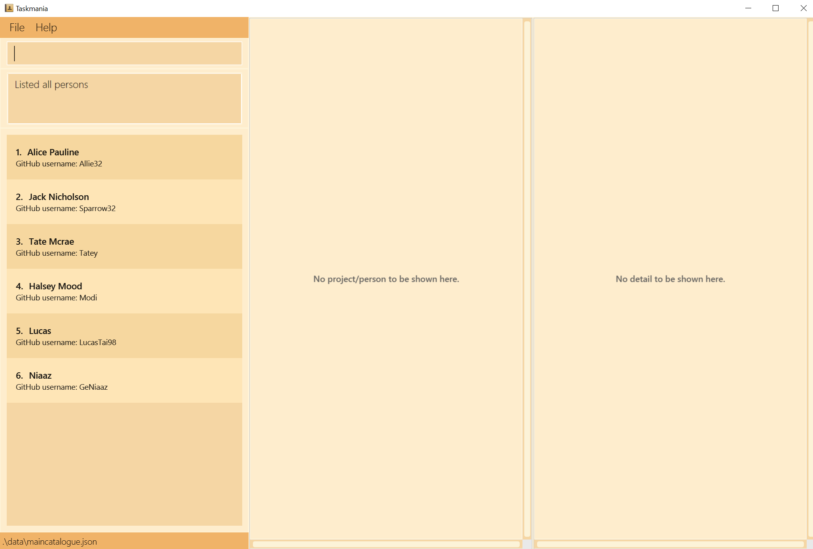

   *Figure 27: What the app looks like after 'listpersons' command*

Step 2: The user enters a DeleteTeammate command such as `deleteperson GeNiaaz`. The command text is passed into
 `LogicManager` (an implementation of Logic) which
 passes the raw text into the `MainCatalogueParser` to validate the first command word, which in this case is
  `deleteperson`. A new instance of `DeletePersonParser` class is then created which proceeds to parse the various
   fields of the command. Any invalid fields such as invalid field prefixes or invalid format of data would throw an
    exception at this stage. 

To illustrate, the object diagram below shows the how Project and Person classes are related to each other, through the
 use of an association class Participations.
    

**How Project and Person are associated**
    
Project and Person cannot be directly linked, and hence are related in this manner to allow the Participation class to
 handle the association. If the instance of Participation is deleted for example, the Project and Person can still
  exist, without an association between them.

If the Git Username is valid, the `allPeople` list in Person (*which is a list of all persons, stored as a static
 variable in Person class*) would be searched for a teammate with a matching Git Username and deleted from the list
  . All projects would also be searched for instances of participation with a teammate with a matching Git Username
   and removed. 

Within the `DeletePersonCommand` class, an instance of `DeletePersonCommand` is created, and this instance of
 `Command` is passed back to `LogicManager`.

LogicManager then calls the method `execute` of the DeletePersonCommand which deletes instances of itself in
 all instances of participation as well as in memory and storage.
 
 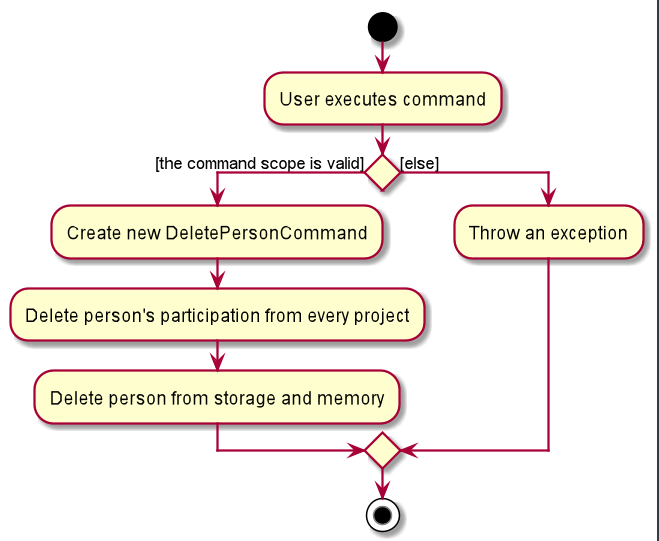
 
 #### Design consideration:
 
 ##### Aspect: Which scope deletion of a teammate should happen in.
 
 * **Alternative 1 (current choice):** Deletion should happen in the listperson scope.
   * Pros: All teammates can be viewed at once, and one can be selected for deletion there.
   * Pros: Teammate can be deleted even if all associations deleted from all projects.
   * Cons: The user has to navigate to another menu to delete the teammate.
   
   (While it does indeed require the user to change scope to delete a teammate, deleting a teammate is not something
    the user will be doing regularly, and so we believe the pros outweigh the cons in this case.)
 
 * **Alternative 2:** Deletion should happen in the project scope.
   * Pros: A teammate can be deleted quickly.
   * Cons: It would be impossible to delete a teammate if all associations are deleted.
   * Cons: User would have to know which project the temmate is associated and navigate there to delete it. 

--------------------------------------------------------------------------------------------------------------------

## **Extension Suggestions**

### Person management

**Current implementation in the project:**
Call `listpersons` and `startperson` command can start the view of `Person` dashboard, which summarizes the information of this person, including the projects, tasks that this person involved in.

**Extension features:**
Allow more manipulations on persons after entered the view of `Person` dashboard, including filtering tasks, viewing task dashboards, etc.

**Extension guidelines:**
The behaviors of managing persons would be similar to the behaviors of managing projects. Thus, it is possible to reuse the commands that are set for `PROJECT` or lower scope. There are two suggested approaches:
1. Duplicate the relevant commands in `PROJECT` scope to make them available in `PERSON` scope.
2. Change the scoping requirement of existing `PROJECT` scope commands and change the behavior to accommodate both scopes.

### Teammate comparing

**Current implementation in the project:**
Call `viewteammate` to view one teammate and call it again to view another.

**Extension features:**
Allow for multiple teammates to be viewed side by side to compare qualifications and other characteristics to 
determine who is most suitable for a project.

**Extension guidelines:**
The behaviour of comparing teammates would be akin to seeing 2 teammates side by side. In this scenario, each teammate
would have more attributes such as experience, educational qualifications etc.

The teammates displayed side by side would be compared attribute by attribute to allow the user to see at a 
glance which teammate to pick for a project easily.

### More records for projects and persons

**Current implementation in the project:**
The key of the application lies in `Participation`, the association class of `Person` and `Project`.
The app now allows a list of `Tasks` for each `Participation`, but there are many other attributes possible for `Participation`.

**Extension features:**
It is possible to add more realistic records for `Participation`. They would basically fall in the two categories:
1. Single attribute for each `Participation`, such as `Role`.
2. Collective attribute for each `Participation`, such as `Meetings`.

**Extension guidelines:**
For single attributes, future developers may simply add a field in the `Participation` class and add relevant manipulation methods.
They can also create a new class for this attribute if it is complicated.

For collective attributes, future developers may refer to how `Task` is implemented. 
Basically, it would require future developers to create a new class of this attribute and keep a list in either the `Participation`, `Person` or `Project`.
Other relevant tasks would need to be done, including adding commands (and parsers if needed), creating dashboards of these attributes, and making higher-level commands (such as filter, edit, etc.) to accommodate the new attributes.

### More task implementation

**Current implementation in the project:**
The implementation of task is very fundamental currently, and are mostly very general such as add, edit, view, delete, and filter.
The attributes of `Task` are very simple, too, which includes only a deadline and progress in addition to basic information such as name and description.

**Extension features:**
It is possible to allow advanced `Task` management, such as allowing recurring of tasks.
This may also be done for other collective attributes that are newly added.

**Extension guidelines:**
Create new fields and methods in `Task` class and implement relevant commands.

### Custom attributes for projects and persons

**Current implementation in the project:**
All attributes are hardcoded in the app, and are determined by developers.

**Extension feature:**
It is possible to allow the users to create custom attributes for projects and persons.

--------------------------------------------------------------------------------------------------------------------

## **Documentation, logging, testing, configuration, dev-ops**

* [Documentation guide](Documentation.md)
* [Testing guide](Testing.md)
* [Logging guide](Logging.md)
* [Configuration guide](Configuration.md)
* [DevOps guide](DevOps.md)

--------------------------------------------------------------------------------------------------------------------

## **Appendix: Requirements**

### Product scope

**Target user profile**: team leaders who are managing software projects:

* has a growing number of projects and teammates to manage
* prefers desktop apps over mobile apps 
* can type fast and prefers typing to mouse interactions
* is tech-savvy and reasonably comfortable using CLI apps

**Value proposition**: manage projects, teammates, and tasks on a unified platform as opposed to scattered on
 different messaging platforms

### User stories

Priorities: High (must have) - `* * *`, Medium (nice to have) - `* *`, Low (unlikely to have) - `*`
<!-- need to be updated according to our final product -->

| Priority | As a …​                                 | I want to …​                | So that I can …​                                                     |
| -------- | ------------------------------------------ | ------------------------------ | ---------------------------------------------------------------------- |
| `* *`  | new user                                   | see usage instructions         | refer to instructions when I forget how to use the App                 |
| `* * *`  | project team leader | add a new teammate |                      |  
| `* * *`  | project team leader | edit a teammate |  change details of a teammate                     |  
| `* * *`  | project team leader | add a teammate to another project | have a teammate in multiple projects |
| `* * *`  | project team leader | remove a teammate from a project | remove a teammate when he leaves a project   |
| `* * *`  | project team leader | delete a teammate | remove a teammate who has left my team entirely |
| `* * *`  | project team leader   | add a project                  |                      |
| `* *`  | project team leader  | view projects of a teammate      | assess a specific teammate's workload |
| `* *` | project team leader   | view a dashboard of tasks my project   | see at a glance what needs to be done for a project  |
| `* * *`| forgetful user | add in teammate's information           | keep track of my teammate's contact information                                                 |
| `* * *`    | fast typing user  | use a Command line type Interface | have higher efficiency when managing my team's workload |

### Use cases

#### System: Project Profile Tracking System (PTS)

**Use Case: UC1 - Create New Project**

**Actor:** User

**MSS:**

1. User creates a new project profile.
2. PTS asks for the details of project such as `projectName`, `deadline`, `repoUrl` and `projectDescription`.
3. User keys in the details.
4. PTS stores the project profile into the data file.

   Use case ends.

**Extensions**
      
 * 3a. The given details are not valid.
   * 3a1. PTS shows an error message.
   
   Use case resumes at 3.

**Use Case: UC2 - Edit Existing Project Profile**

**Actor:** User

**MSS:**

1. User chooses to edit a project profile.
2. Same as <u>UC1</u> 2-4.

   Use case ends.

**Extensions**

 * 1a. The project profile does not exist.
   * 1a1. PTS shows an error message.
   
   User case resumes at 1.

#### System: Teammates Tracking System (TMTS)

**Use Case: UC3 - Add A Teammate**

**Actor:** User

**MSS:**

1. User creates a new teammate's profile.
2. TMTS asks for the details of the teammates such as `personName`, `phone`, `email`, and `gitUserName`.
3. User keys in the details.
4. TMTS stores the teammate's profile into the data file.

   Use case ends.

**Extensions**

 * 3a. The given details are not valid.
   * 3a1. TMTS shows an error message.
   
   Use case resumes at 3.

**Use Case: UC4 - Edit An Existing Teammates**

**Actor:** User

**MSS:**

1. User chooses to edit a teammate's profile.
2. PTS asks for the `gitUserName` of the teammate whose profile is to be edited.
3. User keys in the `gitUserName` of the teammate.
4. Same as <u>UC3</u> 2-4.

   Use case ends.

**Extensions**

 * 3a. Person with the given `gitUserName` does not exist.
   * 3a1. TMTS shows an error message.
   
   User case resumes at 3.
   
#### System: Project Management System (PMS)

**Use case: UC5 - Start A Project**

**Actor:** User

**MSS:**

1. User requests to find a project.
2. PMS shows a filtered list of projects according to the conditions of the project to find given by the User.
3. User requests to start a target project with its index.
4. PMS shows the dashboard of the project.

   Use case ends.

**Extensions**

 * 1a. The conditions result in an empty filtered list of projects.
   * 1a1. PMS shows an error message.
   
   Use case resumes at 1.
   
 * 3a. The index is not valid.
   * 3a1. PMS shows an error message.
   
   Use case resumes at 3.

 * 3b. The project has already been shown on the dashboard.

   Use case ends.

**Use case: UC6 - Find A Task**

**Precondition:** The application has already started a project.

**Actor:** User

**MSS:**

1. User requests to find a task.
2. PMS asks for specifications for filtering.
3. User provides details of the task wanted such as `taskName`, `description`, and `assignee`s. <!-- have we allowed multiple assignee-searching? -->
4. PMS shows the list of filtered tasks with given specifications.

   Use case ends.

**Extensions:**

 * 4a. Task wanted is not in the filtered list.
   
   Use case resumes at 3.
   

**Use case: UC7 - Add A New Task**

**Precondition:** The application has already started a project.

**Actor:** User

**MSS:**

1. User requests to add a task in a project.
2. PMS asks for details of the task such as `taskName`, and `deadline`.
3. User keys in details.
4. PMS stores the task's profile into the data file.
5. User <u>UC6: finds the task</u> just added.
6. PMS shows a filtered list of task including the new task added.
7. User requests to assign the task to a teammate.
8. PMS associates the task with the teammate and stores in the data file.
9. Repeat 7-8 until all assignees have been added.

   Use case ends.

**Extensions**

 * 3a. The given details are not valid.
   * 3b1. PMS shows an error message. 

   Use case resumes at 3.

 * 5a. The task is intended for no assignees.

   Use case ends.

 * 5b. The task can be easily found in the current list.

   Use case resumes at 7.

 * 7a. The input task index is invalid or the teammate is not found in the project.
   * 7a1. PMS shows an error message.

   Use case resumes at 7.

 * 7b. The task has already been associated with the teammate.
   * 7b1. PMS shows an error message.

   Use case resumes at 9.

**Use Case: UC8 - View Task Details**

**Actor:** User

**Precondition:** The application has already started a project.

**MSS:**

1. User <u>UC6: finds the task</u> wanted.
2. PMS shows a filtered list of task including the new task added.
3. User requests to view the task.
4. PMS asks for the task index.
5. User keys in the task index.
6. PMS shows the profile of the task.

   Use case ends.

 * 5a. The given task number is not found.
   * 5a1. PMS shows an error message.
   
   Use case resumes at 5.

**Use case: UC9 - Delete A Task**

**Precondition:** The application has already started a project.

**Actor:** User

**MSS:**

1. User <u>UC6: finds the task</u> wanted to be deleted.
2. PMS shows a filtered list of task including the new task added.
3. User requests to delete the task.
4. PMS asks for the task index.
5. User keys in the task index.
6. PMS deletes the task in the project and updates the data file.

   Use case ends.

**Extensions**

 * 5a. The given task number is not found.
   * 5a1. PMS shows an error message.
   
   Use case resumes at 5.

### Non-Functional Requirements

1.  The application should work on any _mainstream OS_ (tested on Windows, Mac, Linux) as long as it has Java `11` or above installed.
1.  The application should be able to hold up to 30 projects and 150 teammates without a noticeable drop in performance.
1.  The application can function without an internet connection.
1.  A user with above average typing speed for regular English text (i.e. not code, not system admin commands) 
should be able to accomplish most of the tasks faster using commands than using the mouse.
1.  There are checks for the inputs the user gives, and corresponding tips are presented if the input format is incorrect.
1.  There are `help` commands to tell the user what command does what.
1.  Information is presented in a pleasing way.
1.  New user can learn the software easily and quickly (so that other teammates can help organize or add tasks if they want to)
1.  Tests are written for important components, and every working prototype must pass all the test first.
1.  Code is written in an easy-to-maintain manner (e.g. no extremely long function).

### Glossary

* **Mainstream OS**: Windows, Linux, Unix, OS-X.
* **Participation**: The class of an object that handles the relations between a Project object and Person Object.
* **Scope**: The confines of when certain commands will work.
* **Teammate**: A member of the user's team in a project.
* **Person**: A person that could be in any number of the user's team's projects.
* **Project**: A software project with a GitHub repository link and a deadline.
* **Task**: Something to be done for a project with a certain progress status.
--------------------------------------------------------------------------------------------------------------------

## **Appendix: Instructions for manual testing**

Given below are instructions to test the app manually.

:information_source: **Note:** These instructions only provide a starting point for testers to work on;
testers are expected to do more *exploratory* testing.

### Launch and shutdown
<!-- this part has not been written -->
1. Initial launch

   1. Download the jar file and copy into an empty folder

   1. Double-click the jar file Expected: Shows the GUI contains of three columns. The leftmost column contains 
   command box, a result display box, and a set of sample projects. The middle column shows a project dashboard while
   the rightmost column shows a task or teammate dashboard.

1. Saving window preferences

   1. Resize the window to an optimum size. Move the window to a different location. Close the window.

   1. Re-launch the app by double-clicking the jar file. 
       Expected: The most recent window size and location is retained.

### Deleting a project

1. Deleting a project while all projects are being shown

   1. Prerequisites: List all projects using the `list` command. Multiple projects in the list.

   1. Test case: `delete 1` 
      Expected: First contact is deleted from the list. Details of the deleted contact shown in the status message. Timestamp in the status bar is updated.

   1. Test case: `delete 0` 
      Expected: No project is deleted. Error details shown in the status message. Status bar remains the same.

   1. Other incorrect delete commands to try: `delete`, `delete x`, `...` (where x is larger than the list size) 
      Expected: Similar to previous.

### Adding a Teammate 

1. Adding a teammate into a project while in a project scope
   1. Prerequisites: Have a valid project created, and start with `startproject 1`. 

   1. Test case: `addteammate mn/Lucas mg/LucasTai98 mp/93824823 me/lucas@gmail.com ma/18 Evelyn Road ` 
      Expected: A new teammmate is added to project 1.  "New Teammate added: LucasTai98" message is returned to the
       user.

   1. Test case: `addteammate` 
      Expected: No teammate added to the project. Error details about incorrect format shown to user.
      .

   1. Other incorrect delete commands to try: `addteammate mn/%&`, `add teammate ...`,  where the input is incomplete
    or the command is incorrect.   Expected: Similar to previous.
    
### Deleting a Teammate from listpersons scope

1. Deleting a teammate while in listpersons view
   1. Prerequisites: Have a valid teammate created as described just above, and enter listpersons scope with
    `listpersons`. 

   1. Test case: `deleteteammate LucasTai98 ` 
      Expected: A teammate is deleted. Teammate is deleted and all participations in projects are deleted as well
      . Message is returned to the user to tell the user deletion was a success.
   1. Test case: `deleteteammate 2` 
      Expected: No teammate is deleted. Error details about incorrect format shown to user.

   1. Other incorrect delete commands to try: `deleteteammate`, `delete teammate ...`,  where the input is incomplete
    or the command is incorrect.   Expected: Similar to previous.
    
### Editing a Teammate from project scope

1. Editing a teammate while in a project's view
   1. Prerequisites: Have a valid teammate in a project created as described just above, and enter project scope with
    `startproject 1`. 

   1. Test case: `editteammate LucasTai98 mn/Wiener ` 
      Expected: Teammate's name is changed to Wiener, everything else, including the GitUserName, is changed
      . Feedback to the user tells the user it is successful.
   1. Test case: `editteammate LucasTai98` 
      Expected: No teammate is edited. Taskmania complains that no data to change the attributes of Teammate were
       included.

   1. Other incorrect delete commands to try: `editteammate`, `editteammate $%%v`,  where the input is incorrect or 
   .   Expected: Similar to previous.

### Saving data

1. Dealing with missing/corrupted data files

   1. Test case: Delete maincatalogue.json to simulate a missing data file.  
      Expected: A new maincatalogue.json is created with default projects and persons.
   
   1. Test case: Delete "Participations" from maincatalogue.json.  
      Expected: Taskmania will start with an empty maincatalogue.json with no default projects and persons.
      
### Adding a Task 

1. Adding a task into a project while in a project scope
   1. Prerequisites: Have a valid project created, and start with `startproject 1`. 

   1. Test case: `addtask tn/Refactor Person class tp/0 ` 
      Expected: A new task is added to project 1.  "New task added: [Refactor Person Class]" message is returned to the
       user.

   1. Test case: `addtask` 
      Expected: No task added to the project. Error details about incorrect format shown to user.
      .

   1. Other incorrect delete commands to try: `addtask tn/%&`, `add teammate ...`,  where the input is incomplete
    or the command is incorrect.   Expected: Similar to previous.
    
