------------------------------------------------------------------------------------------------

Taskmania (based off AB3) is a **desktop application for a project leader to manage team members and tasks** to be
 finished in a software project, optimized for use via a Command Line Interface (CLI) while still having the benefits
  of a Graphical User Interface (GUI). If you can type fast, Taskmania can allow you to manage your team faster than 
 a traditional point and click interface.

## Table of contents

 * Table of Contents
 {:toc}

--------------------------------------------------------------------------------------------------------------------

# 1 Quick start (Tan Chia Qian)

1. Ensure that you have Java `11` or above installed in your Computer.

2. Download the latest `Taskmania.jar` from [here](https://github.com/AY2021S1-CS2103T-W10-3/tp).

3. Copy the file to the folder you want to use as the _home folder_ for your Taskmania.

4. Double-click the file to start the app. The window that appears will be similar to the below should appear in a few seconds. Note how
 the app contains some sample information. 
   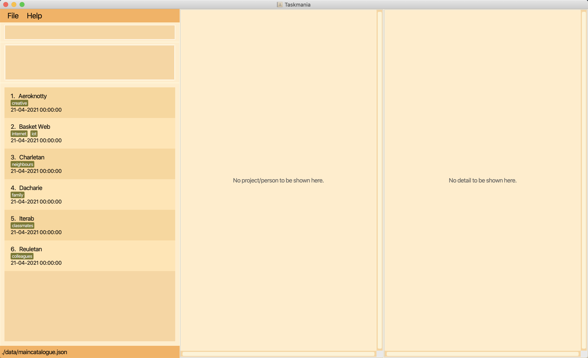
   *Figure 1: A view of Taskmania at startup*

5. Type the command in the command box and press Enter to execute it. e.g. typing `help` and pressing `Enter` to
 open the help window. 
   Some commands you can try:

   * `startproject 1` : Opens the first project

   * `exit` : Exits the app

6. Refer to the features below for details of each command.

--------------------------------------------------------------------------------------------------------------------

**:information_source: Notes about the command format:** 

* Words in `UPPER_CASE` are the parameters to be supplied by the user. 
  e.g. In `add n/NAME`, `NAME` is a parameter which can be used as `add n/John Doe`.

* One and only one item in parenthesis should be supplied by the user
  e.g. `(ta/ASSIGNEE_GIHUB_USERNAME)||(td/DEADLINE)` can be used as `ta/Alice98` or `td/31-12-2020 10:00:00`, but not as `ta/Alice98 td/31-12-2020 10:00:00` or empty.

* Items in square brackets are optional. 
  e.g `n/NAME [tg/TAG]` can be used as `n/John Doe t/friend` or as `n/John Doe`.

* Items with `…`​ after them can be used multiple times including zero times. 
  e.g. `[tg/TAG]…​` can be used as ` ` (i.e. 0 times), `tg/friend`, `tg/friend tg/family` etc.

* Parameters can be in any order. 
  e.g. If the command specifies `n/NAME p/PHONE_NUMBER`, `p/PHONE_NUMBER n/NAME` is also acceptable.

**:information_source: Notes about scoping:** 

Each command has a restriction on the scope that it can be run. 
Scopes in this app include `PROJECT_LIST`, `PERSON_LIST`, `PROJECT`, `PERSON`, `TASK`, `TEAMMATE`.
A command may be valid in some scopes not some others. For example, `startperson` command can only be run under
`PERSON_LIST` or `PERSON` scope, otherwise there will be an exception.

There is a hierarchy of the scopes, and in most cases a command that is valid in a parent scope would be valid in any descendant scopes, but this may not always be true.
The hierarchy only serves as a guideline for you to understand scoping implementations. 
Given below is the hierarchy list:

The hierarchy of command scoping is as follows:
* global
    * `PROJECT_LIST` 
      * `PROJECT`
        * `TASK` 
        * `TEAMMATE`
    * `PERSON_LIST`
      * `PERSON`

 

There is also a scoping status at any point in time during execution of the app. 
A command will be executable only if the current scoping status of the app falls in one of the scopes that is valid for this command.
The scoping status of an app can be told from the user interface as follows: 

Scope | Left panel | Middle panel | Right panel
--------|------------------|-------|----------
`PROJECT_LIST` | project list | empty | empty
`PERSON_LIST` | person list | empty | empty
`PROJECT` | project list | project dashboard | empty
`PERSON` | person list | person dashboard | empty
`TASK` | project list | project dashboard | task dashboard
`TEAMMATE` | project list | project dashboard | teammate dashboard

--------------------------------------------------------------------------------------------------------------------

# 2 Features

## 2.1 Features in global scope

### 2.1.1 Viewing help : `help`

Shows a message explaning how to access the help page.

Valid scopes: all.

   *Figure 2: Help message popup*

Format: `help`

### 2.1.2 Exit application : `exit`

Closes the application for the user.

Valid scopes: all.

Format: `exit`

### 2.1.3 Leave a current page `leave`

Leaves the current page and go back to the parent scope (one level up).

Valid scopes: all.

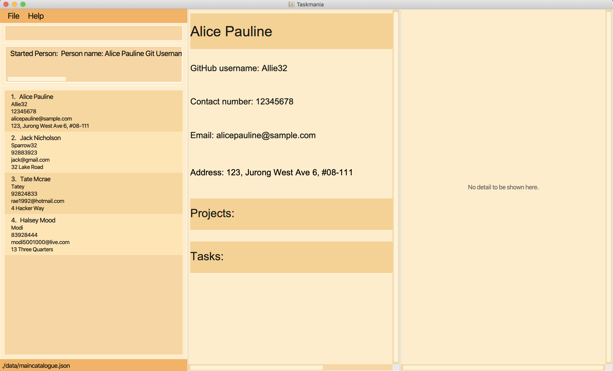

   *Figure 3: Before `leave`, a person named Alice Pauline shows on the person dashboard*

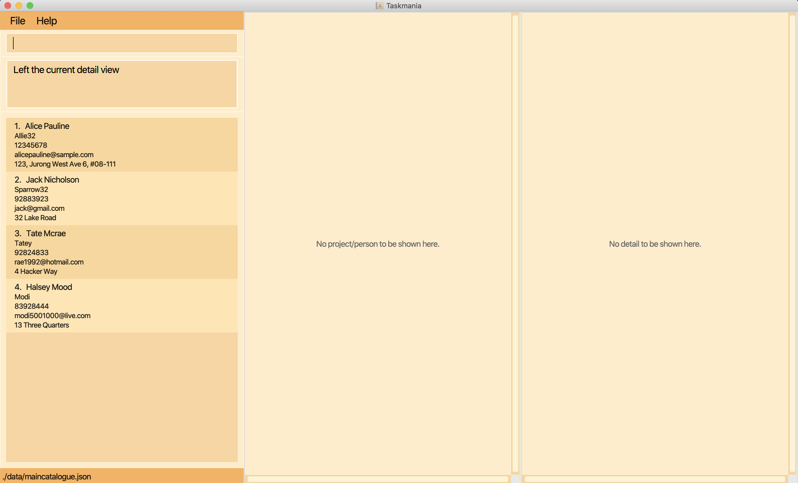

   *Figure 4: After `leave`, person dashboard is cleared*

Format: `leave`
- Leaves the current page (clear the right-most non-empty dashboard) and shifts the scoping status to the parent scope
- If the app is already in the `PERSON_LIST` or `PROJECT_LIST` scope, the command takes no effect

### 2.1.4 List all projects in the catalogue `listprojects`

Lists all projects currently in the catalogue.

Valid scopes: `PROJECT_LIST`, `PROJECT`, `TASK`, `TEAMMATE`, `PERSON_LIST`.

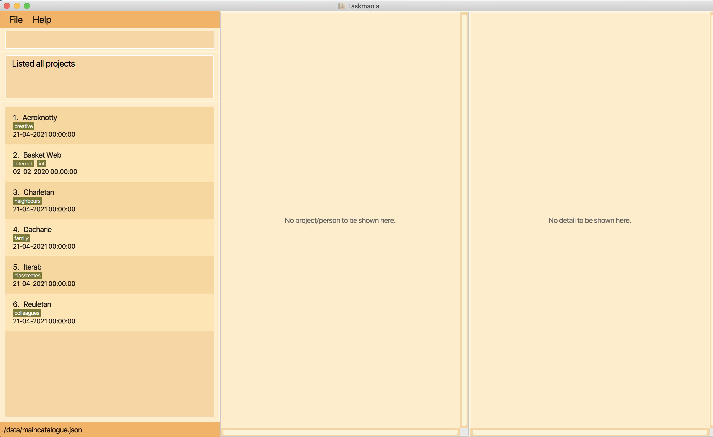

   *Figure 5: List of projects shows up*

Format: `listprojects`
- Lists all projects without filter
- If the scope is `PERSON_LIST` when the command is executed, the scope will be changed to `PROJECT_LIST` 

### 2.1.5 List all persons in the catalogue `listpersons`

Lists all persons currently in the catalogue.

Valid scopes: `PROJECT_LIST`, `PERSON_LIST`, `PERSON`.

   *Figure 6: List of persons shows up*

Format: `listpersons`
- Lists all persons without filter
- If the scope is `PROJECT_LIST` when the command is executed, the scope will be changed to `PERSON_LIST` 

## 2.2 Projects management

### 2.2.1 Start work on an existing project `startproject`

Starts the view of the project specified to work on it specifically.

Valid scopes: `PROJECT_LIST`, `PROJECT`.

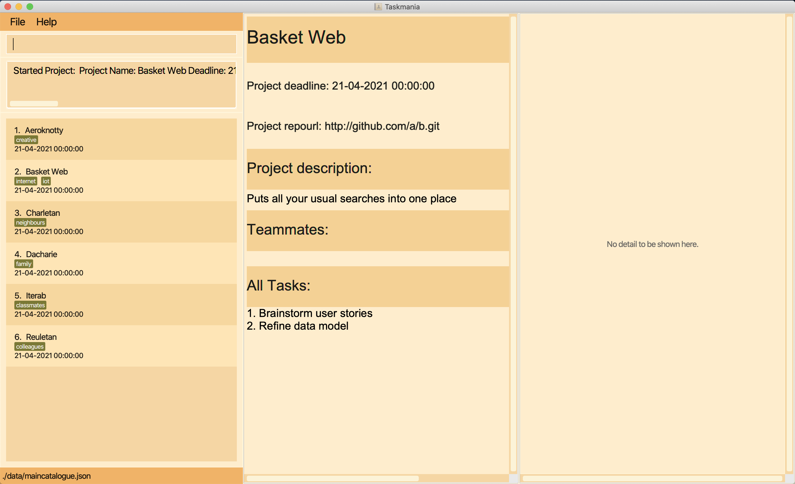

   *Figure 7: Project 2 is started and shown on the project dashboard*

Format: `startproject INDEX`
- Initialises the project at the specified INDEX
- The index refers to the index number shown in the displayed project list
- The index must be a positive integer 1, 2, 3, …​

Examples: `startproject 2` starts the second project in the project list displayed in the left panel.

### 2.2.2 Add a new project to the catalogue `add`

Adds a project to the project list.

Valid scopes: `PROJECT_LIST`, `PROJECT`, `TASK`, `TEAMMATE`.

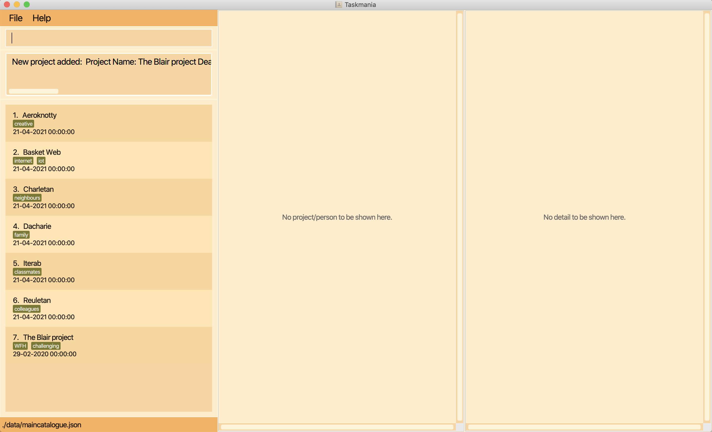

   *Figure 8: A new project named `The Blair project` is added and shown on the project list*

Format: `add n/PROJECT_NAME dl/DEADLINE ru/REPO_URL d/PROJECT_DESCRIPTION [tg/TAGS]... `
  - The fields can be entered in any order, as long as the prefixes are matched correctly
  - Project Name can be any alphanumeric value (containing only alphabets and / or numbers)
  - Deadline follows the format *DD-MM-YYYY hh:mm:ss*
  - The user can set the deadline to be in the past to allow the user wants to log finished projects for the completeness of project management
  - The repository URL must be a valid link
  - Description can be anything, as long as it is not blank
  - Any number of tags can be added, where each new tag would require the prefix tg/ before the tag

Note: Please enter a valid repository URL. Taskmania is an offline application and can only check the validity of the
 URL, and not whether the repository exists.

Example: `add n/Blair project dl/29-02-2020 00:00:00 ru/http://github.com/a/b.git d/Coding in Greenwich tg/hell tg/abs` adds a new project with the following: 
- name of 'Blair project'
- deadline of 29 February 2020 midnight 
- URL for the team repository as http://github.com/a/b.git
- description as 'Coding in Greenwich'
- 2 tags "hell" and "abs"

### 2.2.3 Delete a project from the catalogue `delete` (Tai Wen Le Lucas)

Deletes a project and all associated information from the project catalogue.

Valid scopes: `PROJECT_LIST`, `PROJECT`, `TASK`, `TEAMMATE`.

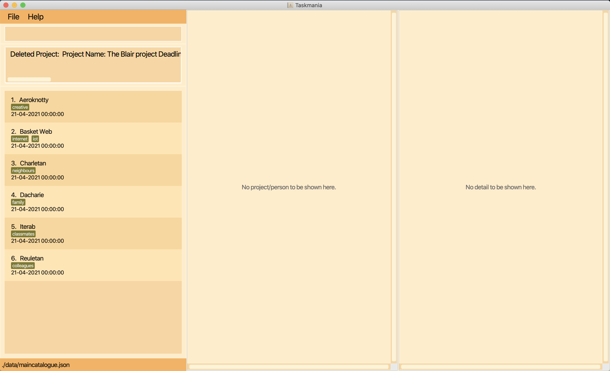

   *Figure 9: The project named `The Blair project` is deleted and removed from the project list*

Format: `delete INDEX `
- Deletes the project at the specified INDEX
- The index refers to the index number shown in the displayed project list
- The index must be a positive integer 1, 2, 3, …​

Examples: `delete 2` deletes the second project from the catalogue.

### 2.2.4 Locate projects by keyword `find` (Tan Chia Qian)

Finds all the projects with the names containing the given keywords.

Valid scope: `PROJECT_LIST`, `PROJECT`, `TASK`, `TEAMMATE`.

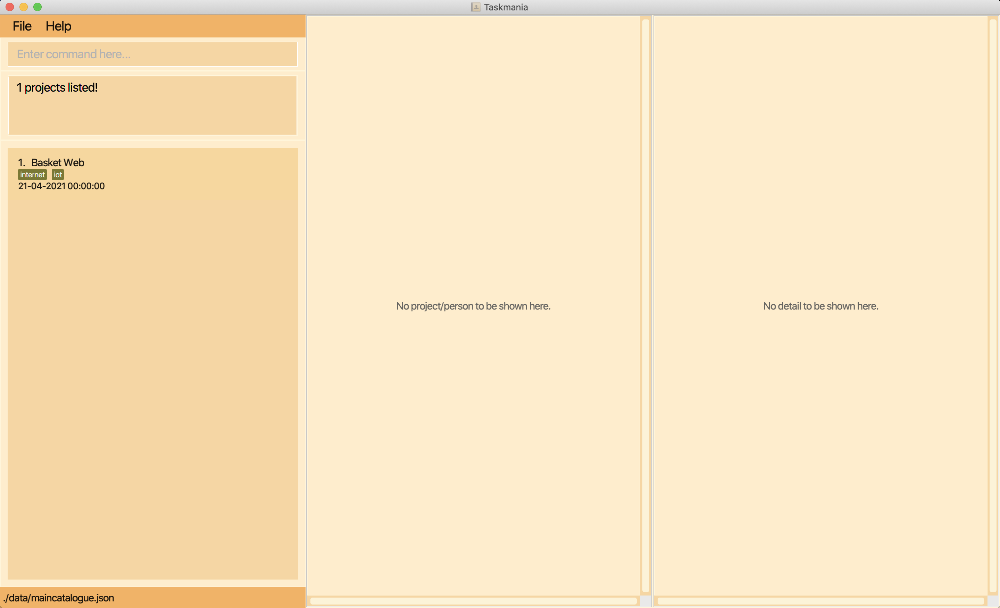

   *Figure 10: The project contains `Basket` is found and shown on the filtered project list*

Format: `find KEYWORD [MORE_KEYWORDS]...`
- The search is case-insensitive. e.g `run` will match `Run`
- The order of the keywords does not matter. e.g. `Project CS2103T` will match `CS2103T Project`
- It only allows searching by the project name
- It must include at least one keyword
- It can include multiple keywords
- Keywords provided must be the **complete words** and will only match the **complete words** from the name of the project. e.g. `find Task` will not return the **Taskmania** project.

Example: `find scare` returns the `Scare House` and `Easily Scare Night` projects.

Note: Please use `listprojects` command to return to the complete project list.

### 2.2.5 Edits details of a project `edit` (Tan Chia Qian)

Updates the details of a project.

Valid scope: `PROJECT_LIST`, `PROJECT`, `TASK`, `TEAMMATE`.

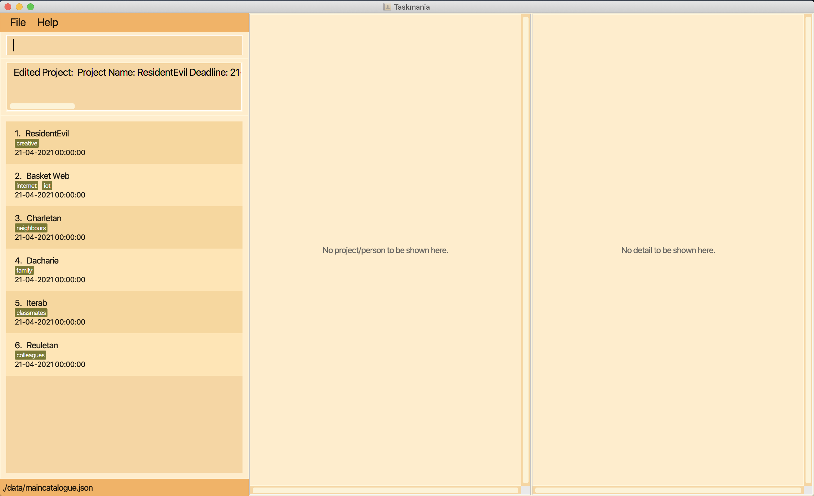

   *Figure 11: The first project on the project list is edited*

Format: `edit INDEX [n/PROJECT NAME] [dl/DEADLINE] [ru/REPO URL] [d/PROJECT DESCRIPTION] [tg/TAGS...] `
  - Edits the project at the specified index
  - The index refers to the index number shown in the displayed task list
  - Any combination of the fields above can be entered
  - The information entered will replace all the data in each respective field
  - The project name can be any alphanumeric value (containing only alphabets and / or numbers)
  - The deadline follows the format of *DD-MM-YYYY hh:mm:ss*
  - The user can set the deadline to be in the past to allow the user wants to log finished projects for the completeness of project management
  - The repository URL must be a valid link
  - Anything can be filled in the description as long as it is not blank
  - Any number of tags can be added, separated by space " "

Example: `edit 1 n/ResidentEvil d/ new horror` changes the name of the first project in the list to `ResidentEvil` and the description to `New Horror`.

Note: Please enter a valid repository URL. Taskmania is an offline application and it can only check the validity of the
 URL, and not whether the repository exists.
 
 
## 2.3 Tasks management within a project

### 2.3.1 Add task to a project `addtask` (Tai Wen Le Lucas)

Creates a new task and adds it to the current project.

Valid scopes: `PROJECT`, `TASK`, `TEAMMATE`.

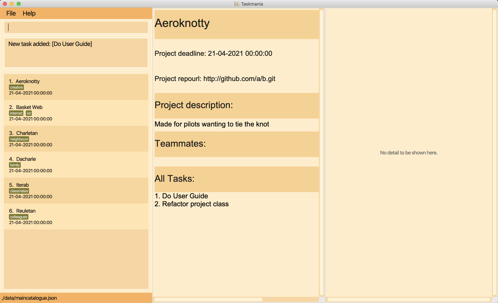

   *Figure 12: The task named `Do User Guide` is added to the project `Aeroknotty`*

Format: `addtask tn/TASK NAME td/TASK DEADLINE [tp/TASK PROGRESS] [d/TASK DESCRIPTION]`
  - All fields above are required
  - Task name can be any alphanumeric value (containing only alphabets and / or numbers)
  - Task progress is a percentage value indicating how much of the task is done
  - Task deadline is indicated by a date and time with the format *DD-MM-YYYY hh:mm:ss* 
  - The user can set the deadline to be in the past to allow the user to log finished tasks for the completeness of project management

Example: `addtask tn/Do User Guide tp/30 td/29-02-2020 00:00:00` creates a task named Do User Guide, 30% completed, and has a deadline of 29th Feb 2020, midnight.

### 2.3.2 Assign a task to a teammate `assign`

Assigns a task to a teammate within a project.

Valid scopes: `PROJECT`, `TASK`, `TEAMMATE`.

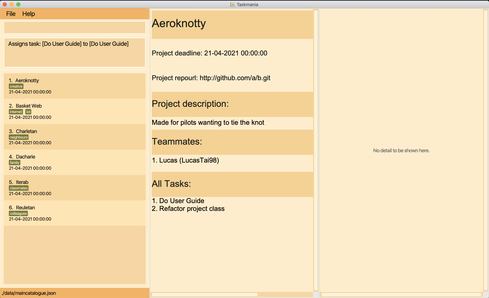

   *Figure 13: The task named `Do User Guide` is assigned to `LucasTai98`*

Format: `assign TASKINDEX TEAMMATE_GITHUB_USERNAME  `

  - TEAMMATE_GITHUB_USERNAME is the unique Github username of each teammate
  - Assigns the teammate with the given Github username to the task at the specified index
  - The index refers to the index number shown in the displayed task list

Example: `assign 1 Lucas98` assigns task number 1 in the list to user *Lucas98*.

### 2.3.3 Edit task to a project `edittask` (Tai Wen Le Lucas)

Edits the indicated task in a project.

Valid scopes: `PROJECT`, `TASK`, `TEAMMATE`.

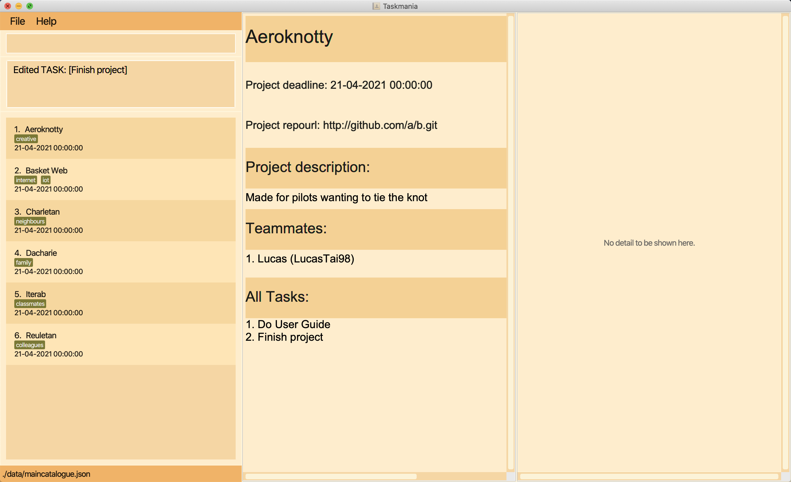

   *Figure 14: The second task being edited*

Format: `edittask INDEX [n/TASK_NAME] [tp/TASK_PROGRESS] [td/TASK_DEADLINE] [d/TASK_DESCRIPTION]`
  - Edits the task at the specified index
  - The index refers to the index number shown in the displayed task list
  - Any combination and any number of the subsequent fields above can be entered
  - The information entered will replace all the data in each respective field
  - Task Name can be any alphanumeric value (containing only alphabets and / or numbers)
  - Task progress is a percentage value indicating how much of the task is done
  - Task deadline is indicated by a date and time with the format *DD-MM-YYYY hh:mm:ss* 
  - The user can set the deadline to be in the past to allow the user to log finished tasks for the completeness of project management
  - Anything can be filled in the task description as long as it is not blank

Example: `edittask 2 tn/Finish project` changes the name of the second task in the list to 'Finish project'.

### 2.3.4 Delete a task from the project `deletetask` (Tian Fang)

Deletes a task and all associated information from the project.

Valid scopes: `PROJECT`, `TASK`, `TEAMMATE`.

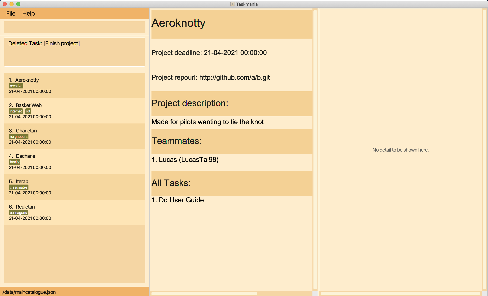

   *Figure 15: The task named `Finish project` is deleted and removed from the task list*

Format: `deletetask INDEX`

- Deletes the project at the specified `INDEX`
- The `INDEX` refers to the index number shown in the displayed task list
- The `INDEX` must be a positive integer 1, 2, 3, …​

Examples: `deletetask 2` deletes the second task shown in the displayed task list.

### 2.3.5 Filter tasks `filter` (Tian Fang)

Filters tasks in the task list by various task attributes:

  - by assignee's GitHub username - `ta/ASSIGNEE_GITHUB_USERNAME`
  - by task's name - `tn/KEYWORD [MORE_KEYWORDS]...`
  - by deadline (either specifying a deadline - `td/DEADLINE` or a time range for the deadline - `start/START_DATE end/END_DATE` )
  - by progress - `tp/TASK_PROGRESS`
  - by done status - `done/DONE_STATUS` (when a task's progress is 100, it is "done")

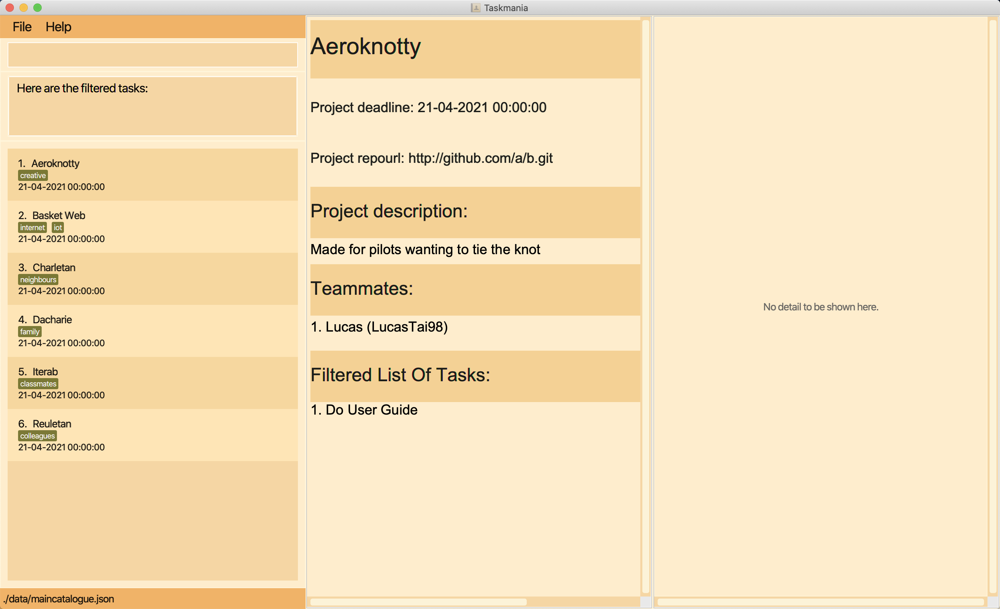

   *Figure 16: The task list is filtered by `ta/LucasTai98` and only the task assigned to `LucasTai98` is shown on filtered task list*

Valid scopes: `PROJECT`, `TASK`, `TEAMMATE`.

Format: `filter (ta/ASSIGNEE_GITHUB_USERNAME)||(tn/KEYWORD [MORE_KEYWORDS]...)||(td/DEADLINE)||(start/START_DATE end/END_DATE)||(tp/TASK_PROGRESS)||(done/DONE_STATUS)` 

- User may choose one task attribute to filter tasks by

Specifically:

1. `filter ta/ASSIGNEE_GITHUB_USERNAME` finds all the tasks that are assigned to the person with the given Github username.
2. `filter tn/KEYWORD [MORE_KEYWORDS]...` finds tasks whose task names contain the given keywords
   - The search is case-insensitive. e.g `data` will match `Data`
   - The order of the keywords does not matter. e.g. `model refactoring` will match `refactoring model`
   - Only the name of the tasks are searched
   - Must provide at least one keyword
   - There can be multiple keywords
   - Keywords provided must be **complete words** and will only match **complete words** from the name of the task. e.g. `filter tn/dat` will not return the task `Refine data flow`
3. `filter td/DEADLINE` finds all the tasks whose deadlines match the given `DEADLINE`
   - Deadline of the task follows the format *DD-MM-YYYY hh:mm:ss*
4. `filter start/START_DATE end/END_DATE` finds all tasks whose deadlines are within the time range specified by the `START_DATE` and `END_DATE`
   - `START_DATE` and `END_DATE` of the time range follows the format *DD-MM-YYYY*
   - There should be a space between `START_DATE` and `end/`. e.g.`filter start/01-11-2020end/02-11-2020` is invalid
   - `END_DATE` cannot be a date before `START_DATE`
5. `filter tp/TASK_PROGRESS` finds all tasks whose progress match the given `TASK_PROGRESS`
   - `TASK_PROGRESS` should only be integers between 0 and 100 inclusive, and it should not be blank
6. `filter done/true` finds all completed (progress is 100) tasks and `filter done/false` finds all unfinished tasks

Example: `filter tn/CS2103T` finds all the tasks whose task names contain the keyword `CS2103T`, and displays those tasks.

### 2.3.6 List all tasks `alltasks` (Tian Fang)

Lists all tasks in the task list of the project.

Valid scopes: `PROJECT`, `TASK`, `TEAMMATE`.

   *Figure 17: The full task list is shown*

Format: `alltasks `

Example: `alltasks` displays all the tasks in the task list.

### 2.3.7 Sort tasks `sort ` (Tian Fang)

Sorts tasks in the task list by various task's attributes in ascending/descending order:

  - by deadline - `td/`
  - by progress - `tp/`
  - by task's name - `tn/`
  - by done status - `done/` (when a task's progress is 100, it is "done")

Valid scopes: `PROJECT`, `TASK`, `TEAMMATE`.

Format: `sort (sa/)||(sd/) (td/)||(tp/)||(tn/)||(done/)` 
  - User may choose the sorting order (`sa/` for ascending order and `sd/` for descending order)
  - User may choose one attribute of task to sort the task list
  - User may apply filter and sorter at the same time

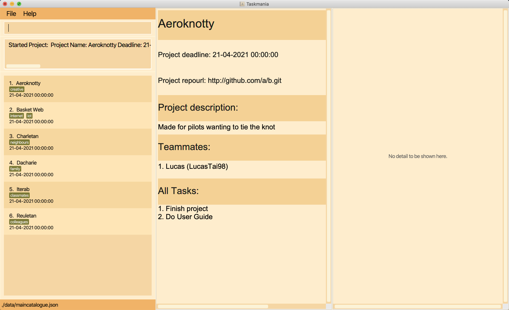

   *Figure 18: Before `sort`*

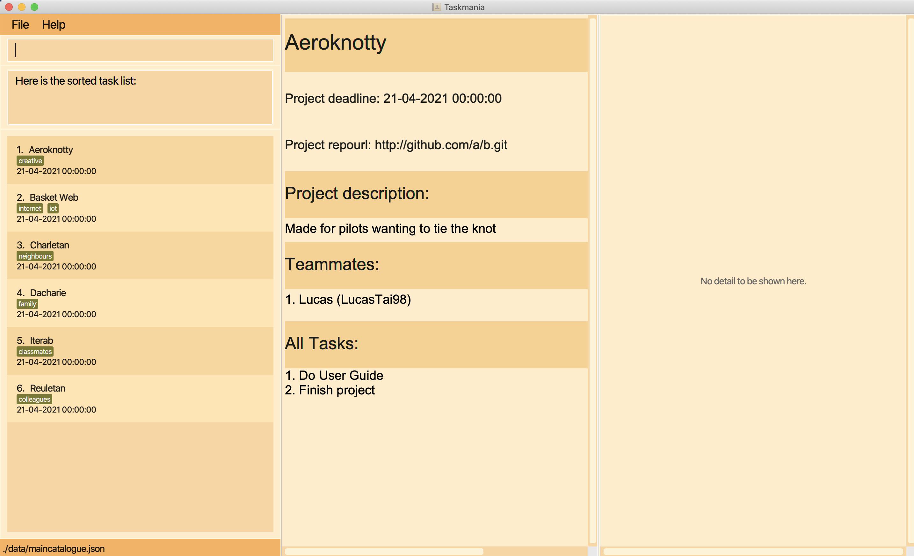

   *Figure 19: After `sort` by task name in ascending order*

Format: `sort (sa/)||(sd/) (td/)||((tp/)||(tn/)||(done/)` 

Example: `sort sa/ td/` sorts the task list by task deadline in ascending order. Then the tasks on the top of the task list are those with imminent deadlines.

### 2.3.8 View details of a task `viewtask`

Views all the details of a task, beyond the little information given in the project view.

Valid scopes: `PROJECT`, `TASK`, `TEAMMATE`.

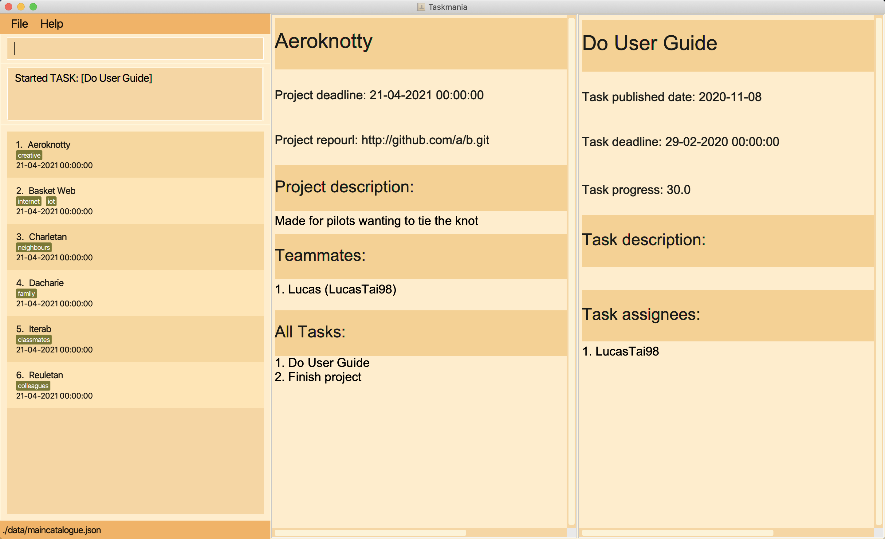

   *Figure 20: The task 1 is shown on the task dashboard*

Format: `viewtask INDEX `
  - View all the information of the task specified by the INDEX
  - Index has to be a valid number that is in the range of tasks displayed on screen

Example: `viewtask 1` displays all information from task number 1 in the list.

## 2.4 Teammate and person management within a project

### 2.4.1 Create a new person `addperson`

Creates a new person in the main catalogue with all the relevant fields contained in it.
If the app is currently working on a project, this person will also be added to this project at the same time.

Valid scopes: all.

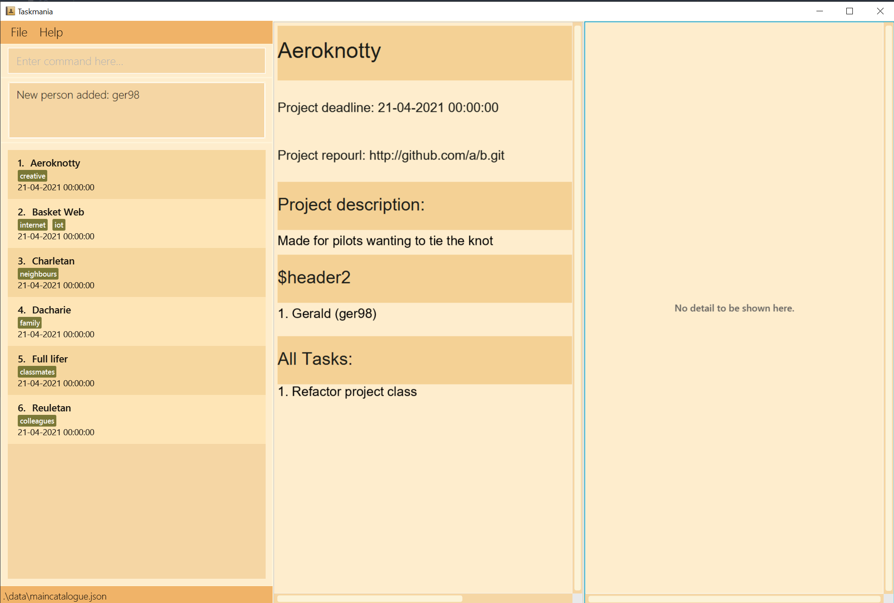

   *Figure 21: New teammate `Lucas` is added to the project and shown on the teammate list*

Format: `addperson mn/TEAMMATE_NAME mg/GITHUB_USERNAME mp/PHONE_NUMBER me/EMAIL ma/ADDRESS`
  - All fields are necessary to fill in
  - Teammate name has to be 1 or more words consisting only of letters
  - The Github username has to be a unique Github registered User Name
  - The phone number has to be a minimum of 3 and maximum of 16 numbers
  - The email has to have a proper prefix and proper domain name consisting of at least 2 letters
  - Address can be any amount of letters, symbols and numbers, the only constraint is that it cannot be blank

Example: `addperson mn/Lucas mg/LucasTai98 mp/93824823 me/lucas@gmail.com ma/18 Evelyn Road` creates a new teamamte in the respective project with:
  - name Lucas
  - Github username of Lucas98
  - phone number of 93824823
  - email of lucas@gmail.com
  - address of 18 Evelyn road

### 2.4.2 Add a person to a project `addtoproject`

Add an existing person to the current project, making them a teammate.

Valid scopes: `PROJECT`, `TASK`, `TEAMMATE`.

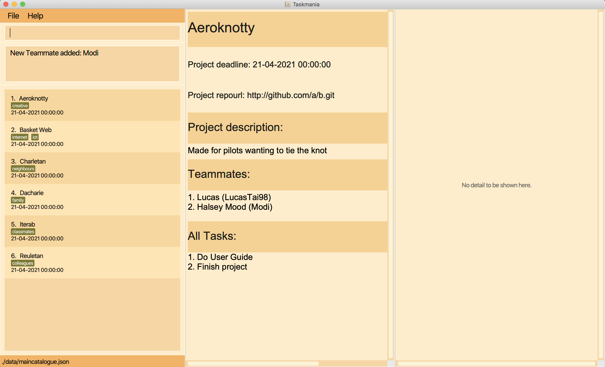

   *Figure 22: The existing person named `Holsey Mood` is added to the project and shown on the teammate list*

Format: `addtoproject GITHUB_USERNAME`

Example: `addtoproject Lucas98` adds Lucas98 to the current project that the user is in.

### 2.4.3 Remove a teammate from a project `deletefromproject`

Removes an existing teammate from the current project.

Valid scopes: `PROJECT`, `TASK`, `TEAMMATE`.

   *Figure 23: The teammate named `Holsey Mood` is deleted from the project and removed from the teammate list*

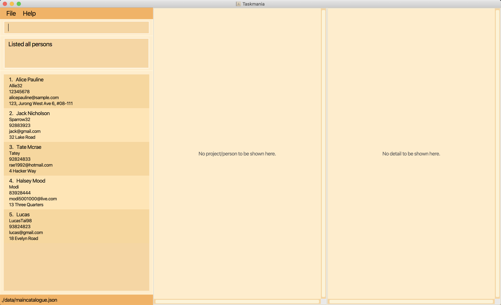

   *Figure 24: The teammate named `Holsey Mood` is deleted from the project but not deleted from the person list*

Format: `deletefromproject GITHUB_USERNAME`

Example: `deletefromproject Lucas98` removes Lucas98 from the current project.

### 2.4.4 Edit a teammate’s details `editteammate`

Update the information of a teammate.

Valid scopes: `PROJECT`, `TASK`, `TEAMMATE`.

   *Figure 25: The teammate with github user name `LucasTai98` is edited*

Format: `editteammate GITHUB_USERNAME [mn/TEAMMATE_NAME] [mp/PHONE_NUMBER] [me/EMAIL] [ma/ADDRESS]`
  - Any combination or number of fields can be filled in
  - Teammate name has to be 1 or more words consisting only of letters
  - The Github User name cannot be changed, but is required to identify the teammate to edit
  - The phone number has to be a minimum of 3 and maximum of 16 numbers
  - The email has to have a proper prefix and proper domain name consisting of at least 2 letters
  - Address can be any amount of letters, symbols and numbers, the only constraint is that it cannot be blank

Example: `editteammate LucasTai98 mn/LucasTai ma/5 Hacker Way` changes the name of the teammate to LucasTai and the address of said teammate to 5 Hacker Way.

### 2.4.5 View a teammate’s details `viewteammate`

View all of a specific teammate's details.

Valid scopes: `PROJECT`, `TASK`, `TEAMMATE`.

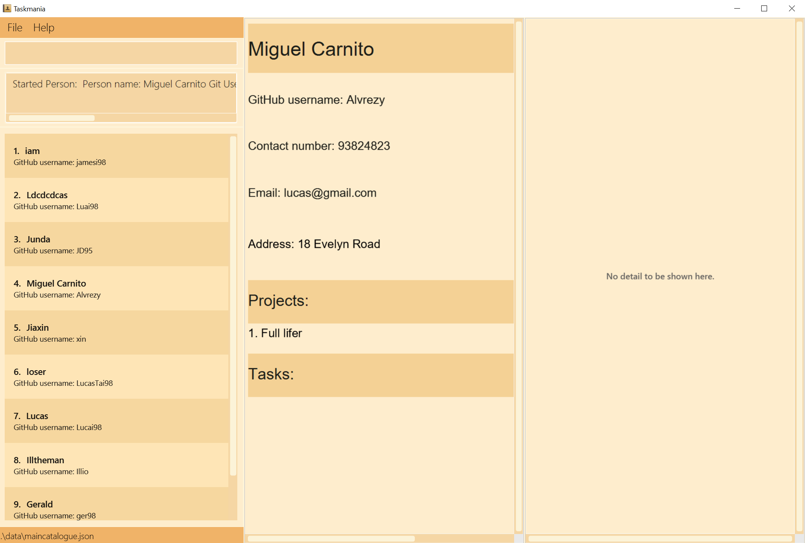

   *Figure 26: The teammate with github user name `LucasTai98` is shown on the teammate dashboard*

Format: `viewteammate GITHUB_USERNAME`

Example: `viewteammate Lucas98` displays all the information about the teammate with the Github User Name Lucas98 to the user.

### 2.4.6 Delete a teammate `deleteperson`

Delete all of a specific teammate's details, as well as remove teammate from all projects teammate was a part of.

Valid scopes: `PERSON_LIST`.

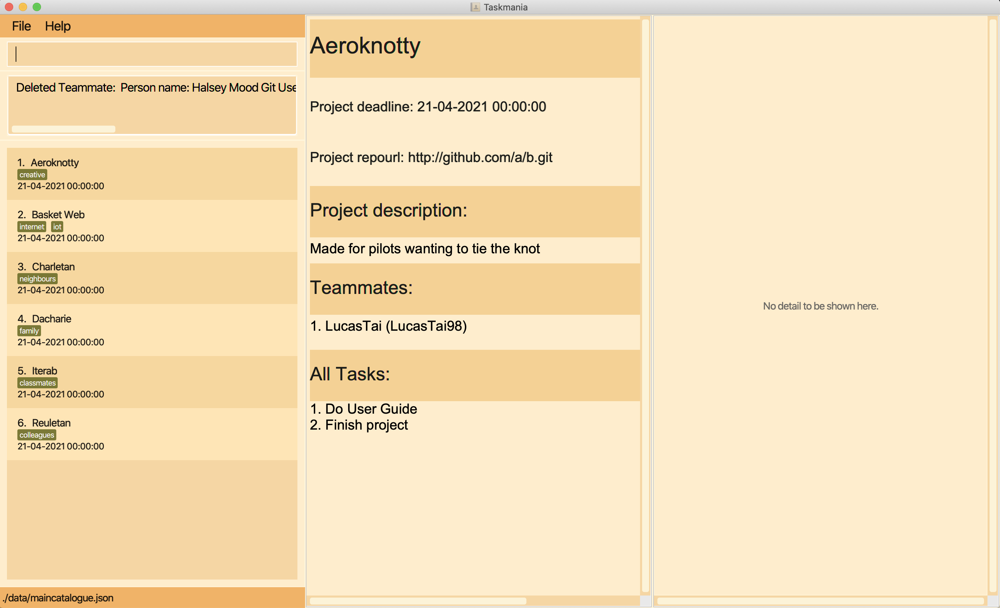

   *Figure 27: The teammate with github user name `Modi` is deleted from the teammate list*

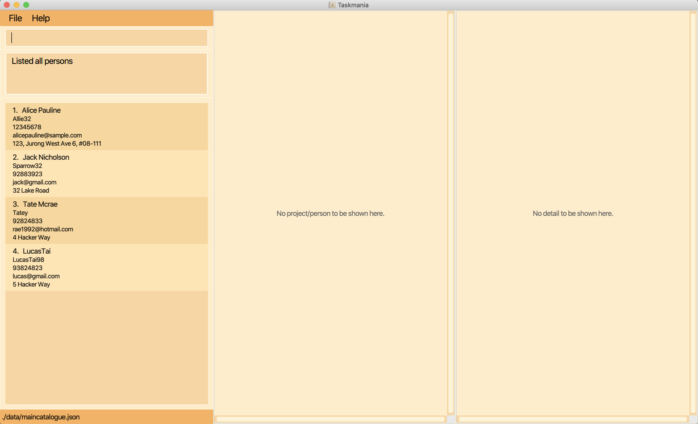

   *Figure 28: The person with github user name `Modi` is also removed from the person list*

Format: `deleteperson GITHUB_USERNAME`

Example: `deleteperson Lucas97` deletes the teammate with Github username Lucas97, and removes him from any project he
 was in.

### 2.4.7 Start work on an existing person `startperson`

Starts the view of the person specified to work on it specifically.

Valid scopes: `PERSON_LIST`, `PERSON`.

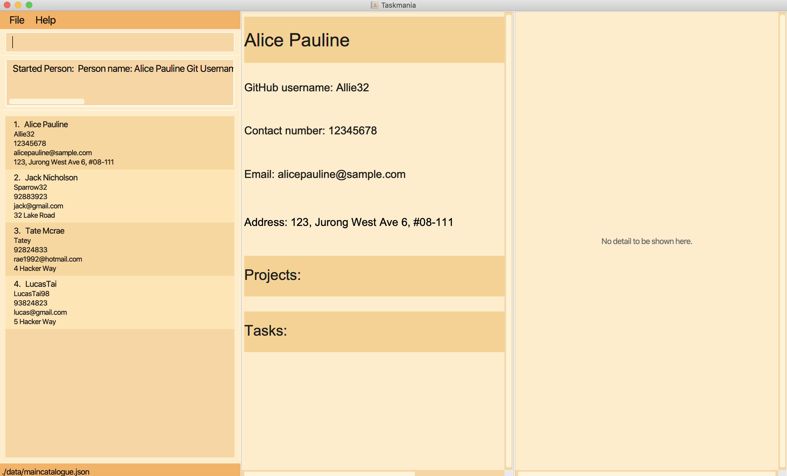

   *Figure 29: The first person on the person list is shown on person dashboard*

Format: `startperson INDEX`
- Initialises the person at the specified INDEX
- The index refers to the index number shown in the displayed person list
- The index must be a positive integer 1, 2, 3, …​

Examples: `startperson 2` starts the second person in the person list displayed in the left panel.

# 3 FAQ

**Q**: How do I transfer my data to another Computer? 
**A**: Install the app in the other computer and overwrite the empty data file with the file that 
contains the data of your previous Taskmania home folder.

**Q**: Is my data stored in the cloud? 
**A**: No, all your data is stored locally, no need to fear a potential data hack.

**Q**: Do I have to save before exiting the application for my data to to safely backed up on my computer?  
**A**: All your data is saved on your computer as soon as you enter in the command. There is no need to manually save
 your data.
 
**Q**: Where do I seek help when I have issue with the application?  
**A**: You may leave your issues [here](https://github.com/AY2021S1-CS2103T-W10-3/tp/issues).

# 4 Summary (Tan Chia Qian)

Action | Format, Examples | Scope: | `PROJECT_LIST` | `PERSON_LIST` | `PROJECT` | `PERSON` | `TASK` | `TEAMMATE`
--------|------------------|-------|---------------|---------------|-------------|--------|--------|------------
**Get Help** | `help` |                                                                                                                                                                                                                                                          | √ | √ | √ | √ | √ | √
**Exit application** | `exit` |                                                                                                                                                                                                                                                  | √ | √ | √ | √ | √ | √
**Leave a view** | `leave` |                                                                                                                                                                                                                                                     | √ | √ | √ | √ | √ | √
**Show all projects** | `listprojects` |                                                                                                                                                                                                                                         | √ | √ | √ |   | √ | √
**Show all persons** | `listpersons` |                                                                                                                                                                                                                                           | √ | √ |   | √ |   |
**Start a project** | `startproject INDEX`  e.g., `startproject 3` |                                                                                                                                                                                                          | √ |   | √ |   |   |
**Start a person** | `startperson INDEX`  e.g., `startperson 3` |                                                                                                                                                                                                             |   | √ |   | √ |   |
**Add project** | `add n/PROJECT_NAME dl/DEADLINE ru/REPO_URL d/PROJECT_DESCRIPTION [tg/TAGS]... `   eg, `add n/Blair project dl/29-02-2020 00:00:00 ru/http://github.com/a/b.git d/Coding in Greenwich tg/challenging` |                                                        | √ |   | √ |   | √ | √
**Delete project** | `delete INDEX`   e.g. `delete 2` |                                                                                                                                                                                                                       | √ |   | √ |   | √ | √
**Find KEYWORD** | `find KEYWORD`   e.g. `find read` |                                                                                                                                                                                                                        | √ |   | √ |   | √ | √
**Edit Project** | `edit [n/PROJECT NAME] [dl/DEADLINE] [ru/REPO URL] [d/PROJECT DESCRIPTION] [tg/TAGS...] ` eg, `edit n/Resident Evil project d/ new horror`|                                                                                                                   | √ |   | √ |   | √ | √
**Add Task** | `addtask tn/TASK_NAME td/TASK_DEADLINE [tp/TASK_PROGRESS] [d/TASK DESCRIPTION]` eg, `addtask tn/Do User Guide tp/30 td/29-02-2020 00:00:00` |                                                                                                                                             |   |   | √ |   | √ | √
**Assign A Task To A Teammate** | `assign INDEX NAME`   e.g. `assign 1 Niaaz` |                                                                                                                                                                                               |   |   | √ |   | √ | √
**Edit task details** | `edittask INDEX [tn/TASK_NAME] [tp/TASK_PROGRESS] [td/TASK_DEADLINE] [d/TASK DESCRIPTION]` eg, `edittask 3 tn/Finish project` |                                                                                                                                   |   |   | √ |   | √ | √
**Delete a task** | `deletetask INDEX`  e.g. `deletetask 1` |                                                                                                                                                                                                                 |   |   | √ |   | √ | √
**Filter tasks** | <code>filter (ta/ASSIGNEE_GITHUB_USERNAME)&#124;&#124;(tn/KEYWORD [MORE_KEYWORDS]...)&#124;&#124;(td/DEADLINE)&#124;&#124;(start/START_DATE end/END_DATE)&#124;&#124;(tp/TASK_PROGRESS)&#124;&#124;(done/DONE_STATUS)</code>  e.g. `filter tn/CS2103T` |   |   |   | √ |   | √ | √
**Show all the tasks** | `alltasks` |                                                                                                                                                                                                                                            |   |   | √ |   | √ | √
**Sort tasks** | <code>sort (sa/)&#124;&#124;(sd/) (td/)&#124;&#124;(tp/)&#124;&#124;(tn/)&#124;&#124;(done/)</code>  e.g. `sort sa/ td/` |                                                                                                                                   |   |   | √ |   | √ | √
**View Details of A Task** | `viewtask INDEX`   e.g. `viewtask 1` |                                                                                                                                                                                                           |   |   | √ |   | √ | √
**Create a new person** | `addperson mn/TEAMMATE_NAME mg/GITHUB_USERNAME mp/PHONE_NUMBER me/EMAIL ma/ADDRESS` e.g. `addperson mn/Lucas mg/LucasTai98 mp/93824823 me/lucas@gmail.com ma/18 Evelyn Road` |                                                                         | √ | √ | √ | √ | √ | √
**Add a teammate to a project** | `addtoproject GITHUB_USERNAME` e.g. `addtoproject LucasTai98` |                                                                                                                                                                                |   |   | √ |   | √ | √
**Remove a teammate from a project** | `deletefromproject GITHUB_USERNAME` e.g. `deletefromproject LucasTai98` |                                                                                                                                                                 |   |   | √ |   | √ | √
**Edit teammate details** | `editteammate GITHUB_USERNAME [mn/TEAMMATE_NAME] [mp/PHONE_NUMBER] [me/EMAIL] [ma/ADDRESS]` e.g. `editteammate Lucas98 tn/GeNiaaz ta/5 Hacker Way`|                                                                                                  |   |   | √ |   | √ | √
**View a teammate’s details** | `viewteammate GITHUB_USERNAME` e.g. `viewteammate Lucas98`|                                                                                                                                                                                      |   |   | √ |   | √ | √
**Delete a teammate** | `deleteperson GITHUB_USERNAME` e.g. `deleteperson Lucas98` |                                                                                                                                                                                         |   | √ |   |   |   | 

# 5 Glossary (Tai Wen Le Lucas)

* **Mainstream OS**: Windows, Linux, Unix, OS-X.
* **Scope**: The confines of when certain commands will work.
* **Teammate**: A member of the user's team in a particular project.
* **Person**: A person that could be in any number of the user's team's projects.
* **Project**: A software project with at least a GitHub repository link and a deadline.
* **Task**: Something to be done for a project with a certain progress status.
* **Catalogue**: A saved list for items like projects or persons.
